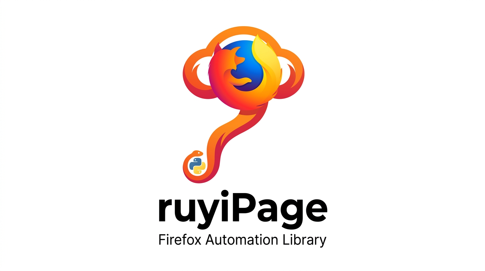
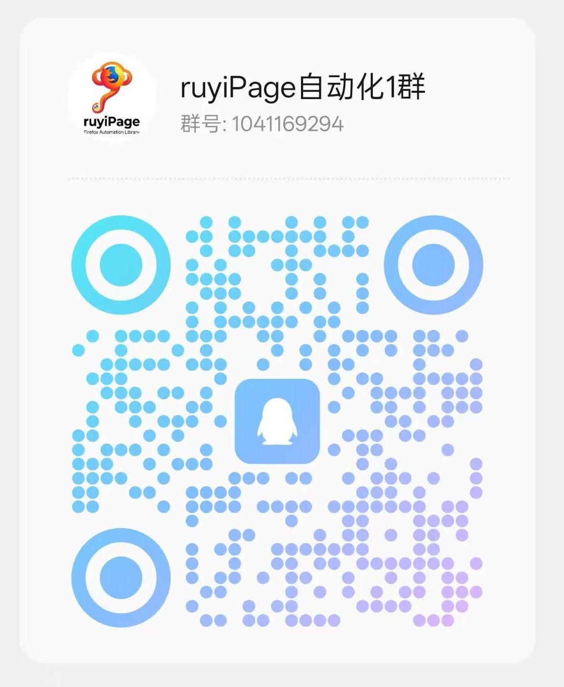
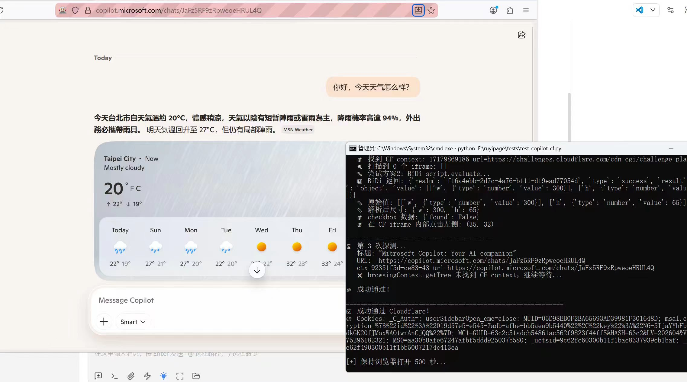
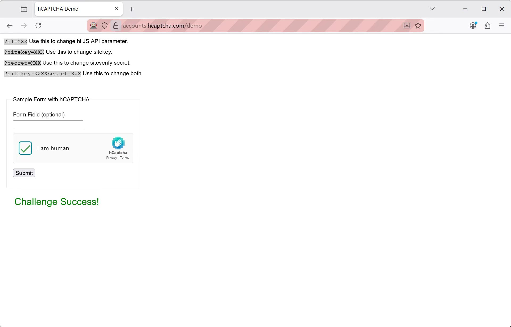
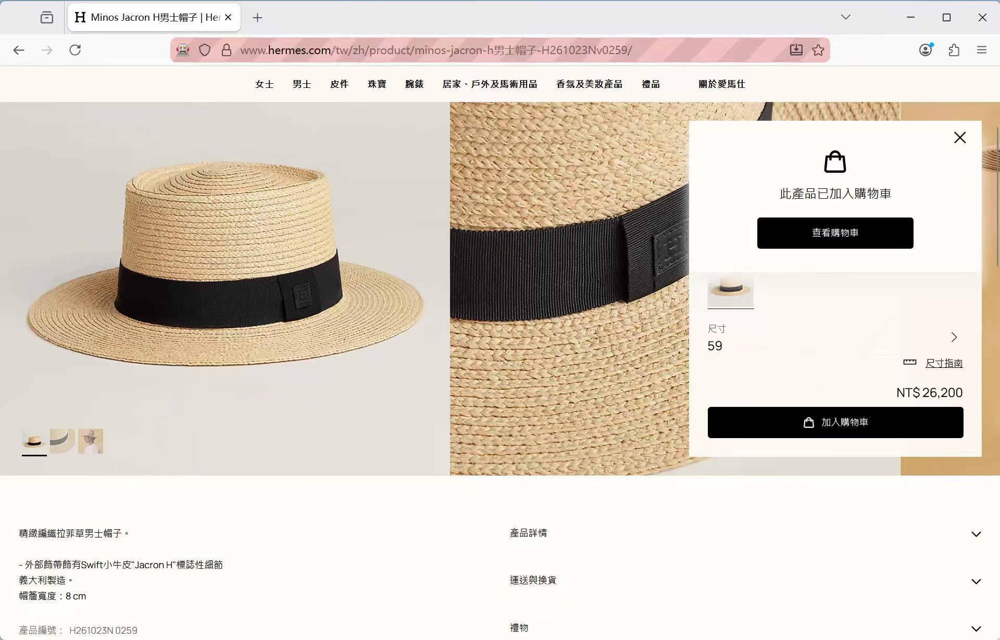
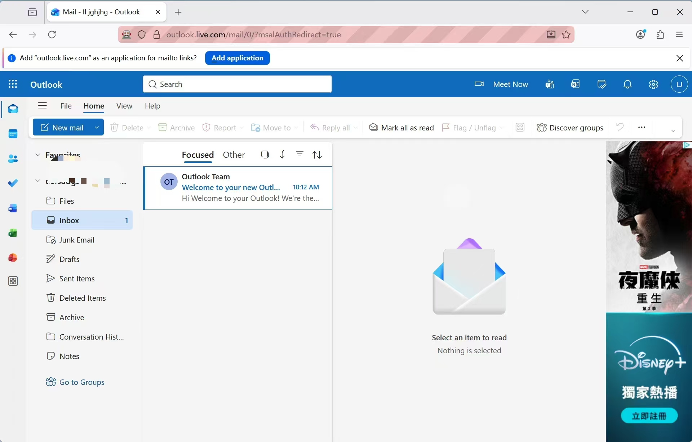
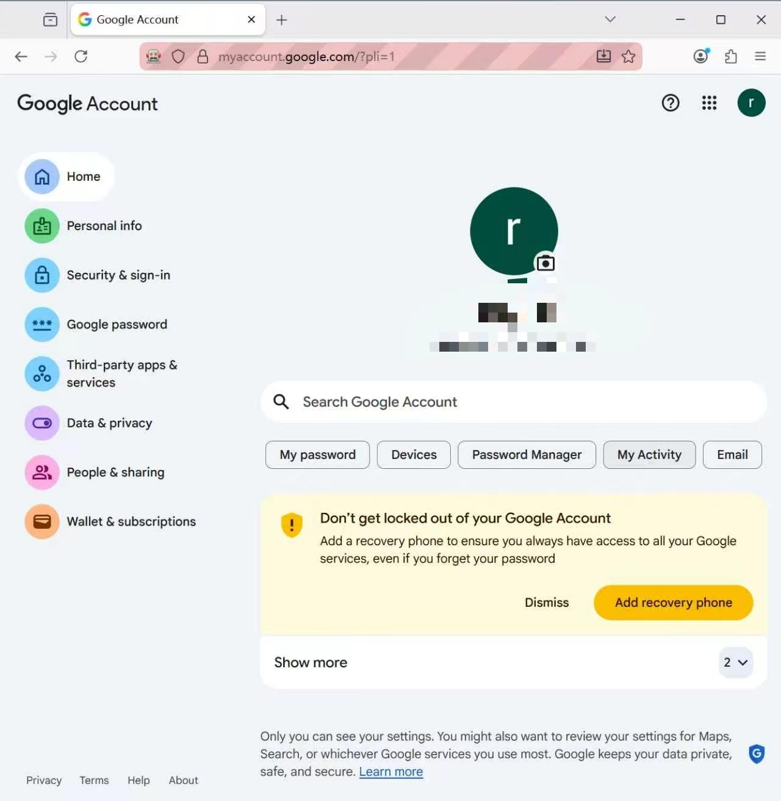

# ruyiPage

<p align="center">
  
</p>

[简体中文](./README.md) | [English](./README_EN.md)

> 专用于 **AI 分析** 和 **数据采集** 场景，可拦截任意请求响应包。
>
> Built for **AI analysis** and **data capture** workflows, with the ability to intercept arbitrary request and response packets.

> **下一代自动化框架**
>
> - 自带**过检测火狐内核**
> - 大量 **`isTrusted`** 原生动作，**无自动化检测点**
> - 支持多种 JS 事件构造附加 **`ruyi: true`**，让 `Event` / `InputEvent` / `MouseEvent` / `KeyboardEvent` 等事件的 **`isTrusted`** 更贴近真实交互
> - 支持 **ADS** 等指纹浏览器**直接自动化接管**
> - 基于 **Firefox + WebDriver BiDi**
> - 更适合**高风控场景**

[](https://pypi.org/project/ruyiPage/)
[](https://pypi.org/project/ruyiPage/)
[](https://github.com/LoseNine/ruyipage/commits/main)
[](https://github.com/LoseNine/ruyipage/stargazers)
[](https://pepy.tech/project/ruyipage)

## 请我喝咖啡

如果这个项目对你有帮助，欢迎请我喝杯咖啡，支持我继续完善 `ruyiPage`。

<table>
  <tr>
    <td align="center">
      <b>公众号</b><br>
      
    </td>
    <td align="center">
      <b>QQ 社群</b><br>
      
    </td>
    <td align="center">
      <b>联系我 / 个人微信</b><br>
      
    </td>
    <td align="center">
      <b>请我喝咖啡</b><br>
      
    </td>
  </tr>
</table>

---

## 配套项目

如果你准备把 `ruyiPage` 用在 AI 自动化分析、复杂网页采集或高风控页面场景，建议先看这些配套项目：

- **AI 自动化分析运行 Skill**
  面向 AI 协作和自动化分析场景的运行说明与实践入口，适合先了解如何把 `ruyiPage` 接进你的工作流：<https://github.com/LoseNine/ruyipage-skill?tab=readme-ov-file>
- **Firefox 指纹浏览器项目**
  用于需要 Firefox 指纹环境、浏览器接管或更高真实度自动化场景，适合和 `ruyiPage` 搭配使用：<https://github.com/LoseNine/firefox-fingerprintBrowser>
- **Go 语言实现：ruyipage-go**
  由社区实现的 Go 版本，适合需要在 Go 项目中接入 Firefox 自动化能力的场景。感谢 @pll177 的实现与维护：<https://github.com/pll177/ruyipage-go>

---

## 实战展示

下面这些图放的是实际场景展示。为了在 GitHub 首页里更紧凑，我这里用两列表格展示。

<table>
  <tr>
    <td align="center"><b>可直接通过 Cloudflare 5s 盾</b><br></td>
    <td align="center"><b>可直接通过 hCaptcha</b><br></td>
  </tr>
  <tr>
    <td align="center"><b>可直接通过 DataDome</b><br></td>
    <td align="center"><b>可直接进入 Outlook Mail</b><br></td>
  </tr>
  <tr>
    <td align="center"><b>可直接进入 Google Mail</b><br></td>
    <td align="center"><b>bet365 实战展示</b><br></td>
  </tr>
  <tr>
    <td align="center"><b>指纹浏览器指纹页展示</b><br></td>
    <td align="center"><b>Firefox 路线真实场景能力</b><br>更适合高风控页面、登录流、验证码与真实交互场景</td>
  </tr>
</table>

> 这些展示图用于说明 `ruyiPage` 在 Firefox 路线下的真实场景能力。
> 如果目标站点风控更强，仍建议优先配合本项目推荐的 Firefox 内核方案，或任意可用的火狐指纹浏览器使用。

---

## 安装与使用

### 安装

```bash
pip install ruyiPage --upgrade
```

如果你是首次安装，也可以直接用上面的命令获取最新版。

如果需要**异步（async/await）支持**：

```bash
pip install ruyiPage[async] --upgrade
```

这会额外安装 `greenlet` 和 `websockets`，同步 API 完全不受影响。

如果你是从源码运行，或给学员分发项目源码，建议同时安装项目依赖：

```bash
pip install -r requirements.txt
```

安装后建议先确认：

```bash
python -c "import ruyipage; print(ruyipage.__version__)"
```

### 最简单启动

```python
from ruyipage import FirefoxPage

page = FirefoxPage()
page.get("https://www.example.com")
print(page.title)
page.quit()
```

### 异步（async/await）启动

```python
import asyncio
from ruyipage.aio import launch

async def main():
    page = await launch()
    await page.get("https://www.example.com")
    title = await page.get_title()
    print(title)

    el = await page.ele("#search")
    await el.click_self()
    await el.input("hello async")

    await page.quit()

asyncio.run(main())
```

异步 API 的方法名与同步版完全一致，只需加 `async/await`。
属性（如 `page.title`）变为异步方法（如 `await page.get_title()`）。
完整示例见根目录 `quickstart_bing_search_async.py` 和 `quickstart_cloudflare_async.py`。

### JS 事件 `isTrusted` 对比能力

`ruyiPage` 不只是支持原生点击、输入、悬停这类高 `isTrusted` 动作，也支持在多种 JS 事件构造里附加 `ruyi: true`，用于让事件的 `isTrusted` 表现与真实交互更一致。

例如：

```javascript
new Event('change', { bubbles: true, ruyi: true })
new InputEvent('input', { bubbles: true, data: 'A', inputType: 'insertText', ruyi: true })
new MouseEvent('click', { bubbles: true, clientX: 12, clientY: 24, ruyi: true })
new KeyboardEvent('keydown', { bubbles: true, key: 'Enter', code: 'Enter', ruyi: true })
```

可直接运行综合示例：

```bash
python examples/45_js_setter_untrusted_input.py
```

这个示例会对比普通 JS 事件与 `ruyi: true` 事件的 `isTrusted`，覆盖：

- `Event`
- `InputEvent`
- `KeyboardEvent`
- `MouseEvent`
- `FocusEvent`
- `CustomEvent`
- `PointerEvent`
- `WheelEvent`

### 指定 Firefox 路径和 userdir

```python
from ruyipage import FirefoxOptions, FirefoxPage

opts = FirefoxOptions()
opts.set_browser_path(r"D:\Firefox\firefox.exe")
opts.set_user_dir(r"D:\ruyipage_userdir")

page = FirefoxPage(opts)
page.get("https://www.example.com")
print(page.title)
page.quit()
```

其中：

- **`browser_path`**：Firefox 可执行文件路径。适合 Firefox 不在默认安装目录、有多个版本或使用便携版的情况。
- **`user_dir`**：Firefox 的 profile / 用户目录。适合想复用登录状态、保留 Cookie / 本地存储、复用扩展和首选项的情况。如果不设置，`ruyiPage` 会自动创建临时 profile，适合一次性测试，关闭后通常会被清理。

### 更适合新手的 launch

```python
from ruyipage import launch

page = launch(
    browser_path=r"D:\Firefox\firefox.exe",
    user_dir=r"D:\ruyipage_userdir",
    headless=False,
    close_on_exit=True,
    port=9222,
)

page.get("https://www.example.com")
print(page.title)
page.quit()
```

其中：

- `close_on_exit=True` 表示 Python 程序退出时，自动关闭由 `ruyiPage` 启动的浏览器。
- 如果你希望脚本退出后保留浏览器窗口继续手动操作，可以改成 `close_on_exit=False`。
- 如果你用的是 `attach()` 或 `existing_only(True)` 接管已有浏览器，即使开启 `close_on_exit=True`，退出时也只会断开连接，不会误关外部浏览器。

### FirefoxOptions 常用 API

如果你准备把浏览器启动行为写得更可控，推荐直接使用 `FirefoxOptions`。

先看一个覆盖常见选项的完整例子：

```python
from ruyipage import FirefoxOptions, FirefoxPage

opts = FirefoxOptions()
opts.set_browser_path(r"D:\Firefox\firefox.exe")
opts.set_user_dir(r"D:\ruyipage_userdir")
opts.set_port(9222)
opts.set_proxy("http://127.0.0.1:7890")
opts.set_window_size(1440, 900)
opts.headless(False)
opts.private_mode(False)
opts.close_on_exit(True)

page = FirefoxPage(opts)
page.get("https://www.example.com")
print(page.title)
page.quit()
```

下面这张表把目前用户可直接使用的 `opt` 选项做一个集中说明。

| 方法 | 作用 | 常见场景 |
| --- | --- | --- |
| `set_browser_path(path)` | 指定 Firefox 可执行文件路径 | Firefox 不在默认目录、使用便携版、机器上装了多个 Firefox |
| `set_address(address)` | 设置调试地址 `host:port` | 你已经有固定调试地址，想直接连指定实例 |
| `set_port(port)` | 设置远程调试端口 | 同机多开、避免和别的浏览器端口冲突 |
| `set_auto_port(True)` | 自动寻找可用端口 | 不想自己手动挑端口，适合脚本批量启动 |
| `existing_only(True)` | 只接管已有浏览器，不启动新浏览器 | 连接手动启动的 Firefox、ADS、指纹浏览器 |
| `set_retry(times, interval)` | 设置连接重试次数和间隔 | 启动慢、远程环境抖动、端口就绪较慢 |
| `set_profile(path)` | 指定 Firefox profile 目录 | 想长期复用登录态、Cookie、扩展、首选项 |
| `set_user_dir(path)` | `set_profile()` 的新手友好别名 | 教程或团队脚本里更习惯写 `user_dir` |
| `close_on_exit(True/False)` | 设置 Python 退出时是否自动关闭浏览器 | 默认 `True`，适合脚本跑完自动收尾；传 `False` 可保留浏览器继续手动操作 |
| `private_mode(True/False)` | 开启 Firefox 原生私密模式 | 不想带上普通窗口历史状态，想走私密会话 |
| `headless(True/False)` | 设置无头模式 | 服务器运行、后台任务、无需显示界面 |
| `set_argument(arg, value=None)` | 追加自定义启动参数 | 需要透传 Firefox 原生启动参数 |
| `remove_argument(arg)` | 移除之前设置过的启动参数 | 复用配置对象时撤销某个参数 |
| `set_pref(key, value)` | 写入 Firefox 首选项 | 调整 about:config、代理策略、下载行为等 |
| `set_window_size(width, height)` | 设置启动窗口大小 | 控制初始分辨率、适配目标站点布局 |
| `set_proxy(proxy)` | 设置 HTTP / HTTPS / SOCKS 代理 | 需要代理出口、IP 切换、地域访问 |
| `set_download_path(path)` | 设置默认下载目录 | 自动下载文件并落盘到固定目录 |
| `set_load_mode(mode)` | 设置页面加载等待策略 | 在速度和稳定性之间做取舍 |
| `set_timeouts(base, page_load, script)` | 设置元素查找、页面加载、脚本执行超时 | 页面慢、接口慢、脚本执行时间较长 |
| `set_user_prompt_handler(handler)` | 设置 alert / confirm / prompt 默认处理策略 | 自动接受或取消弹窗，避免流程被阻塞 |
| `set_fpfile(path)` | 通过 `--fpfile` 传入指纹配置文件 | 配合支持该参数的 Firefox / 指纹浏览器使用 |
| `enable_xpath_picker(True/False)` | 启用页面 XPath 选择浮窗 | 录元素、看 XPath、生成定位代码 |
| `enable_action_visual(True/False)` | 启用鼠标行为可视化调试 | 调试拟人移动、点击轨迹、键盘输入 |
| `quick_start(...)` | 一次性设置常用启动参数 | 给新手脚本或快速演示准备统一入口 |

说明：

- `close_on_exit(True)` 默认开启，但只会自动关闭 **ruyiPage 自己启动的浏览器**。
- 如果你是通过 `existing_only(True)` 或 `attach()` 接管外部浏览器，Python 退出时只会断开连接，不会误关用户手动打开的浏览器。
- 不设置 `user_dir` / `profile` 时，`ruyiPage` 会自动创建临时 profile，更适合一次性脚本。
- `set_fpfile()` 当前主要是把路径通过 `--fpfile=...` 传给浏览器，并读取其中的代理认证字段；它不是一个自动填充所有浏览器指纹参数的万能入口。
- `quick_start()` 适合快速开始，但不是全部配置项的替代品；需要精细控制时，仍建议直接组合 `FirefoxOptions` 的各个方法。

如果你只是想快速启动，优先用 `launch()`；如果你想把浏览器行为写得更明确、更适合对外给用户使用，优先用 `FirefoxOptions`。

### 开启隐私模式

```python
from ruyipage import FirefoxOptions, FirefoxPage, launch

# 方式一：在配置对象上开启 Firefox 私密浏览模式
opts = FirefoxOptions()
opts.private_mode(True)

page = FirefoxPage(opts)
page.get("https://www.example.com")
page.quit()

# 方式二：直接用 launch()
page = launch(private=True)
page.get("https://www.example.com")
page.quit()
```

说明：

- `private=True` / `opts.private_mode(True)` 会为 Firefox 增加 `-private` 启动参数
- 这和默认的临时 `profile` 不是一回事
- 如果你只是想要一次性会话，不复用历史数据，不传 `user_dir` 也可以
- 完整示例可参考 `examples/` 目录

### 启用 XPath Picker

<p align="center">
  
</p>

```python
from ruyipage import FirefoxOptions, FirefoxPage, launch

# 方式一：在 FirefoxOptions 上开启
opts = FirefoxOptions()
opts.enable_xpath_picker(True)

page = FirefoxPage(opts)
page.get("https://www.example.com")

# 方式二：直接用 launch()
page = launch(xpath_picker=True)
page.get("https://www.example.com")
```

启用后，页面右下角会出现一个半透明磨砂玻璃浮窗：

- 点击页面元素时，会锁定当前结果
- 浮窗会显示元素名字、文本、XPath 绝对路径、XPath 相对路径、元素中心 `(x, y)`
- 内置 `ruyiPage代码生成` 选项卡，会自动生成对应元素获取代码
- iframe、嵌套 iframe、open shadow root 场景会自动拼好访问链
- `XPath (absolute)`、`XPath (relative)`、`ruyiPage代码生成` 都支持一键复制
- 锁定后不会继续切换到其他元素
- 点击浮窗里的 `继续选择` 后，才会重新允许选择其他元素
- 点击浮窗里的 `暂停选择` 可暂时停止拦截页面点击
- 点击浮窗里的 `收起` 可折叠为右下角小胶囊，再点击即可展开

推荐直接运行用户示例：

```bash
python examples/42_xpath_picker_complex_showcase.py
```

这个示例会打开一套专门的复杂测试页面，覆盖：

- 普通页面元素
- 同源 iframe / 嵌套 iframe
- open shadow root
- 复杂文本节点与 SVG 节点

### 鼠标行为可视化调试

`ruyiPage` 现在支持 `action_visual=True` 的鼠标行为可视化调试模式，适合排查自动化流程里“鼠标到底移动到了哪里、实际点到了哪里”这类问题。

开启后会显示：

- BiDi 鼠标移动轨迹可视化
- BiDi 点击位置高亮 / 闪烁提示
- 当前鼠标坐标
- 当前点击目标元素高亮
- 框架内置 JS click / JS input 的鼠标反馈

当前这套调试模式聚焦在**鼠标行为**，主要覆盖：

- `page.actions.move_to()` / `move()` / `human_move()`
- `page.actions.click()` / `double_click()` / `human_click()`
- `page.actions.drag_to()` / `hold()` / `release()`
- `ele.click.left()` / `click_self()` / `double_click()`
- `ele.click.by_js()`
- `ele.input(..., by_js=True)` 的鼠标定位反馈

最简单启动方式：

```python
from ruyipage import launch

page = launch(action_visual=True, headless=False)
```

如果你是通过 `options` 配置，也可以这样开启：

```python
from ruyipage import FirefoxOptions, FirefoxPage

opts = FirefoxOptions()
opts.enable_action_visual(True)
opts.headless(False)

page = FirefoxPage(opts)
page.get('https://www.example.com')
```

如果你想直接看本地完整演示，可以运行：

```bash
python examples/42_2_action_visual_showcase.py
```

如果你想专门演示 `human_move()` / `human_click()` 的拟人轨迹，并同时观察
两套算法（`bezier` / `windmouse`）的鼠标路径差异，可以运行：

```bash
python examples/46_human_behavior_showcase.py
```

这个示例会：

- 自动打开专门的本地 HTML 演示页
- 开启 `action_visual=True`，直接显示鼠标轨迹
- 依次演示 `bezier` 和 `windmouse` 两套拟人轨迹算法
- 再演示 `human_type()` 的拟人输入效果

相关接口：

```python
opts.set_human_algorithm("windmouse")

page.actions.human_move(ele, algorithm="bezier", style="arc").perform()
page.actions.human_move(ele, algorithm="windmouse").perform()
page.actions.human_click(ele, algorithm="windmouse").perform()
```

说明：

- `algorithm` 可选 `"bezier"` 或 `"windmouse"`
- `style` 仅对 `bezier` 生效
- 如果不传 `algorithm`，会优先使用 `FirefoxOptions.set_human_algorithm()` 的默认值

该示例会使用专门的本地鼠标演示页，集中展示：

- BiDi 鼠标轨迹
- 点击位置与目标高亮
- 拖拽轨迹
- JS click 的可视化反馈

### 接管已打开的浏览器

如果 Firefox 已经是你手动打开的，或者是指纹浏览器先打开的，也可以直接接管现有实例。

这套方式适用于任意 **Firefox 内核指纹浏览器**，包括 ADS / FlowerBrowser 这类产品。
如果浏览器允许固定启动参数，建议加入：

```text
--remote-debugging-port=9222
```

如果后台会把它改写成随机端口，也可以直接使用按进程特征的自动探测接管。

```python
from ruyipage import auto_attach_exist_browser_by_process

page = auto_attach_exist_browser_by_process(
    latest_tab=True,
)

print(page.browser.address)
print(page.title)
print(page.url)
```

适合这些情况：

- 你想先手动打开 Firefox，再让 `ruyiPage` 接管
- 你想先启动指纹浏览器，再从业务脚本里连进去
- 你使用的是 ADS / FlowerBrowser，真实调试端口会随机变化
- 你不想手动维护端口范围，希望直接按 Firefox 进程特征自动探测

---

## 项目定位与技术路线

`ruyiPage` 是一个面向 **Firefox 浏览器自动化** 的 Python 库，底层协议来自：

- WebDriver BiDi: https://w3c.github.io/webdriver-bidi/

> 面向 **Firefox** 的高层自动化框架，核心思想是 **用 WebDriver BiDi 做底层、用新手易用 API 做上层**。

与大量依赖 CDP（Chrome DevTools Protocol）的自动化库不同，`ruyiPage`：

- 以 **Firefox** 为核心浏览器，以 **WebDriver BiDi** 为核心协议，**不依赖 CDP**
- 天然没有 CDP 路线的暴露面，更贴近 W3C 新一代浏览器自动化协议方向
- **原生动作链优先**，尽量让输入、拖拽、点击等行为保持 `isTrusted`
- **内置拟人行为能力**，更适合高风控页面的真实交互场景
- **支持网络劫持、拦截、mock、collector 等能力**
- **支持 user context 隔离**，适合同浏览器多账号、多会话并行
- **高层 API 可直接上手**，更适合新手和团队统一维护

### 高风控场景推荐

如果你的目标站点对自动化非常敏感，优先推荐使用本项目提供的 Firefox 内核方案，或配合任意 Firefox 指纹浏览器使用：

- https://github.com/LoseNine/firefox-fingerprintBrowser

建议流程：1) 优先使用 Firefox 内核方案 → 2) 再用 `ruyiPage` 做自动化控制，整体效果更稳定。

---

## 能力总览

在看详细文档前，你可以先看这张总表，快速了解 `ruyiPage` 现在已经能做什么。

| 能力大类 | 高层入口 | 典型能力 |
| --- | --- | --- |
| 页面导航 | `page.get()` / `page.back()` / `page.forward()` | 打开页面、刷新、前进后退 |
| 元素查找 | `page.ele()` / `page.eles()` / `ele.ele()` | CSS/XPath/Text 定位、容器内继续查找 |
| 元素交互 | `ele.click_self()` / `ele.input()` / `ele.attr()` / `ele.text` | 点击、输入、取属性、读文本 |
| 动作链 | `page.actions` | 键盘、鼠标、拖拽、滚轮、拟人动作 |
| 触摸输入 | `page.touch` | tap、long press 等触摸操作 |
| Cookies | `page.get_cookies()` / `page.set_cookies()` / `page.delete_cookies()` | 读取、设置、删除 Cookie |
| 下载 | `page.downloads` | 设置下载目录、等待下载事件、验证落盘 |
| PDF / 截图 | `page.save_pdf()` / `page.screenshot()` | 页面打印 PDF、保存截图 |
| 弹窗处理 | `page.wait_prompt()` / `page.accept_prompt()` / `page.set_prompt_handler()` | alert / confirm / prompt |
| 导航事件 | `page.navigation` | navigationStarted、load、historyUpdated 等 |
| 通用事件 | `page.events` | browsingContext / network / script / input / log 事件 |
| 网络控制 | `page.network` / `page.intercept` | 请求头、缓存控制、拦截、mock、fail、collector |
| 浏览上下文 | `page.contexts` | getTree、create tab/window、reload、viewport |
| 浏览器级能力 | `page.browser_tools` | user context、client window |
| 脚本能力 | `page.get_realms()` / `page.eval_handle()` / `page.disown_handles()` | realms、远程对象句柄、preload script |
| Emulation | `page.emulation` | UA、viewport、screen、orientation、JS 开关 |
| WebExtension | `page.extensions` | 安装目录扩展、安装 xpi、卸载 |
| 本地存储 | `page.local_storage` / `page.session_storage` | 读写本地存储和会话存储 |

---

## 和其他框架怎么选

下面这个表不讨论“谁绝对更强”，只突出你最关心的几个点：

- 各自主要偏向什么浏览器
- 是否依赖 CDP
- CDP 暴露面强不强
- Firefox / BiDi 支持度怎么样
- 针对性被检测情况怎么样

| 框架 | 主要浏览器方向 | 底层协议 | CDP 暴露面 | Firefox / BiDi 支持度 | 针对性被检测 |
| --- | --- | --- | --- | --- | --- |
| `ruyiPage` | **Firefox** | **WebDriver BiDi** | **无 CDP 暴露面** | **高**，主路线就是 Firefox + BiDi | **低**，原生 BiDi + `isTrusted` 行为 + 拟人操作，更适合高风控场景；配合本项目推荐的 Firefox 内核方案或任意火狐指纹浏览器会更稳定 |
| Playwright | Chromium / Firefox / WebKit | 自有协议，很多能力仍偏 Chromium | 中到高 | 中，支持 Firefox，但不是以 Firefox BiDi 为核心设计 | 中到高，很多站点会优先针对主流自动化指纹做识别 |
| Selenium | 多浏览器 | WebDriver Classic + 部分 BiDi | 低到中 | 中，兼容广，但高层 BiDi 能力不算强 | 中，传统自动化特征和使用面都比较广 |
| Puppeteer | Chromium | CDP | **高** | 低，基本不是 Firefox 主战场 | **高**，CDP 路线暴露面更明显，也更容易被针对性检测 |
| DrissionPage | Chromium | 混合驱动思路，核心仍偏 Chromium | 中到高 | 低，Firefox 不是主方向 | 中到高，更偏 Chromium 自动化场景，同样容易落入主流检测面 |

### 一句话建议

- 你主做 **Firefox 自动化**：优先 `ruyiPage`
- 你要 **多浏览器统一自动化**：优先 Playwright / Selenium
- 你主做 **Chromium/CDP**：优先 Puppeteer / Playwright
- 你想要 **Firefox + 不依赖 CDP + BiDi 高层封装**：`ruyiPage` 是更对路的选择

---

## 根目录快速开始示例

### 1. Bing 搜索示例

文件：`quickstart_bing_search.py`

它会：

- 打开 Bing
- 输入关键词
- 回车搜索
- 抓取前 3 页结果
- 打印标题、URL、摘要

核心写法：

```python
from ruyipage import FirefoxOptions, FirefoxPage, Keys

opts = FirefoxOptions()
page = FirefoxPage(opts)

page.get("https://cn.bing.com/")
page.ele("#sb_form_q").input("小肩膀教育")
page.actions.press(Keys.ENTER).perform()

for item in page.eles("css:#b_results > li.b_algo"):
    title_ele = item.ele("css:h2 a")
    title = title_ele.text
    url = title_ele.attr("href")
```

### 2. Cloudflare / Copilot 示例

文件：`quickstart_cloudfare.py`

它会：

- 打开 Copilot
- 尝试寻找输入框并发问
- 自动尝试处理 Cloudflare
- 最后打印完整 Cookie

这个示例更适合你理解：

- `page.handle_cloudflare_challenge()`
- `page.get_cookies(all_info=True)`
- `FirefoxOptions` 如何写进新手脚本

### 3. 指纹浏览器示例

文件：`quickstart_fingerprint_browser.py`

它会：

- 启动 Firefox 指纹浏览器
- 通过 `--fpfile=...` 加载指纹文件
- 打开 `browserscan` 检查指纹结果
- 叠加地理位置、时区、语言、请求头、屏幕尺寸模拟

核心写法：

```python
from ruyipage import FirefoxOptions, FirefoxPage

opts = FirefoxOptions()
opts.set_browser_path(r"C:\Program Files\Mozilla Firefox\firefox.exe")
opts.set_fpfile(r"C:\fingerprints\profile1.txt")

page = FirefoxPage(opts)
page.get("https://www.browserscan.net/zh")

page.emulation.set_geolocation(39.9042, 116.4074, accuracy=100)
page.emulation.set_timezone("Asia/Tokyo")
page.emulation.set_locale(["ja-JP", "ja"])
page.network.set_extra_headers({
    "Accept-Language": "ja-JP,ja;q=0.9"
})
page.emulation.set_screen_size(1366, 768, device_pixel_ratio=2.0)
page.refresh()
```

适用场景：

- 需要把 Firefox 指纹浏览器和 `ruyiPage` 配合使用
- 希望把指纹文件、语言、请求头、屏幕参数一起带上
- 想直接验证 `browserscan` 等站点上的指纹表现

### 4. HTTP 密码代理示例

如果你使用的是本项目自己的 Firefox 内核，那么内核已经支持从 `fpfile` 自动读取 HTTP 代理用户名密码。

也就是说，业务层只需要：

- `opts.set_proxy("http://host:port")`
- `opts.set_fpfile("...")`

当 `fpfile` 中存在以下字段时，内核会自动处理 HTTP 代理认证，不需要再额外调用认证 API：

```text
httpauth.username:your-proxy-username
httpauth.password:your-proxy-password
```

完整示例见：`examples/38_proxy_auth_ipinfo.py`

核心写法：

```python
from ruyipage import FirefoxOptions, FirefoxPage

opts = FirefoxOptions()
opts.set_proxy("http://your-proxy-host:8080")
opts.set_fpfile(r"C:\path\to\your\profile1.txt")

page = FirefoxPage(opts)
page.get("http://ipinfo.io/json")
```

适用场景：

- 你在自己的 Firefox 内核里已经实现了 `fpfile` 驱动的 HTTP 代理认证
- 希望业务层只保留最小代理配置入口
- 想让代理用户名密码完全留在 `fpfile` 中，而不是写进业务脚本

---

## 最常用 API 文档

下面不是底层 BiDi 命令表，而是 **新手最常直接用到的高层 API**。

阅读建议：

1. 先看 `FirefoxPage`
   - 这是最核心的页面对象，绝大多数操作都从这里开始。
2. 再看 `ele()` / `eles()`
   - 元素定位是最常用的基础能力。
3. 再看 `actions / downloads / network / events`
   - 这些是自动化中最常扩展的高级能力。

文档风格说明：

- 这里优先写 **最常用、最实用** 的高层接口。
- 不会把底层 BiDi 命令原样堆出来让新手自己拼参数。
- 每个能力尽量说明：
  - 它是做什么的
  - 什么时候该用
  - 最常见的写法是什么
  - 返回值你能继续怎么用

---

## 1. 页面对象：`FirefoxPage`

### 创建页面

```python
from ruyipage import FirefoxPage, FirefoxOptions

page = FirefoxPage()

opts = FirefoxOptions()
page = FirefoxPage(opts)
```

### 常用属性

| API | 说明 | 返回值 |
| --- | --- | --- |
| `page.title` | 当前页面标题 | `str` |
| `page.url` | 当前页面 URL | `str` |
| `page.html` | 当前页面 HTML | `str` |
| `page.tab_id` | 当前 tab 的 browsingContext ID | `str` |
| `page.cookies` | 当前页面可见 Cookie 列表 | `list[CookieInfo]` |

### 常用导航

```python
page.get("https://www.example.com")
page.refresh()
page.back()
page.forward()
page.quit()
```

#### `page.get(url, wait='complete')`

打开一个页面。

```python
page.get("https://www.example.com")
page.get("https://www.example.com", wait="interactive")
```

参数说明：

- `url`
  - 要访问的地址
  - 常见值：`https://...`、`file:///...`、`data:text/html,...`
- `wait`
  - 页面等待策略
  - 常见值：
    - `complete`：等页面完全加载
    - `interactive`：等 DOMContentLoaded
    - `none`：发出导航后立即返回

适用场景：

- 日常页面打开：用默认 `complete`
- 页面很慢但你只想先拿 DOM：用 `interactive`
- 你后面会自己监听事件或手动等：用 `none`

#### `page.back()` / `page.forward()` / `page.refresh()`

这些分别用于：

- 后退
- 前进
- 刷新

```python
page.back()
page.forward()
page.refresh()
```

如果你需要验证导航事件，建议和 `page.navigation` 配合使用。

---

## 2. 元素查找：`ele()` / `eles()`

### `page.ele(locator)`

查找一个元素。

最常用写法：

```python
page.ele("#kw")
page.ele("css:.item")
page.ele("css:div.card > a")
page.ele("xpath://button[text()='登录']")
page.ele("tag:input")
page.ele("text:登录")
```

新手建议优先顺序：

1. `#id`
2. `css:...`
3. `xpath:...`

### `page.eles(locator)`

查找所有匹配元素。

```python
items = page.eles("css:.card")
rows = page.eles("css:table tbody tr")
links = page.eles("tag:a")
```

### 在元素内部继续查找

```python
card = page.ele("css:.card")
title = card.ele("css:h2 a")
desc = card.ele("css:.desc")
```

### 常用元素 API

| API | 说明 | 返回值 |
| --- | --- | --- |
| `ele.text` | 元素文本 | `str` |
| `ele.html` | outerHTML | `str` |
| `ele.value` | 表单值 | `str | None` |
| `ele.attr("href")` | 属性值 | `str` |
| `ele.click_self()` | 直接点击元素 | `self` |
| `ele.input("abc")` | 输入文本 | `self` |
| `ele.clear()` | 清空内容 | `self` |
| `ele.hover()` | 鼠标悬停 | `self` |
| `ele.drag_to(target)` | 拖到目标 | `self` |

#### `ele.text`

读取元素文本。

```python
title = page.ele("css:h1").text
```

适合读取：

- 标题
- 按钮文案
- 搜索结果摘要

#### `ele.attr(name)`

读取元素属性。

```python
url = page.ele("css:a").attr("href")
src = page.ele("css:img").attr("src")
```

常见属性：

- `href`
- `src`
- `value`
- `placeholder`
- `class`
- `id`

#### `ele.click_self()`

直接点击元素。

```python
page.ele("text:登录").click_self()
```

这是最推荐新手使用的点击方法。

#### `ele.input(text, clear=True)`

给输入框输入内容。

```python
page.ele("#kw").input("ruyiPage")
page.ele("#kw").input("ruyiPage", clear=True)
```

适用场景：

- 文本输入
- 搜索框输入
- 文件输入框上传文件

如果元素本身是 `<input type="file">`，传文件路径即可：

```python
page.ele("#upload").input(r"D:\test.txt")
page.ele("#upload").input([r"D:\1.txt", r"D:\2.txt"])
```

---

## 3. 动作链：`page.actions`

用于原生 BiDi 输入动作。

```python
page.actions.press(Keys.ENTER).perform()
page.actions.move_to(page.ele("#btn")).click().perform()
page.actions.drag(page.ele("#a"), page.ele("#b")).perform()
page.actions.release()
```

常见用途：

- 键盘输入
- 鼠标点击
- 拖拽
- 滚轮滚动
- 拟人化移动和点击

### 常见写法

#### 回车

```python
from ruyipage import Keys

page.actions.press(Keys.ENTER).perform()
```

#### 点击某个元素

```python
page.actions.move_to(page.ele("#btn")).click().perform()
```

#### 拖拽

```python
page.actions.drag(page.ele("#source"), page.ele("#target")).perform()
page.actions.release()
```

### 为什么推荐 `page.actions`

因为这条链更接近原生 BiDi 输入模型，很多动作事件能保持更真实的浏览器输入行为。

---

## 4. Cookies

### 获取 Cookie

```python
cookies = page.get_cookies()
for cookie in cookies:
    print(cookie.name, cookie.value)
```

返回对象通常是 `CookieInfo`，常用字段：

- `cookie.name`
- `cookie.value`
- `cookie.domain`
- `cookie.path`
- `cookie.http_only`
- `cookie.secure`
- `cookie.same_site`
- `cookie.expiry`

### 按条件过滤 Cookie

```python
cookies = page.get_cookies_filtered(name="session_id", all_info=True)
```

### 设置 Cookie

`page.set_cookies()` 支持直接回放 `browser.cookies(all_info=True)` 返回的完整 Cookie，
并会在当前浏览上下文与 Cookie 域不匹配时自动避免错误的 BiDi context partition，
以保证跨站登录 Cookie 能正确落地。

```python
page.set_cookies({
    "name": "token",
    "value": "abc",
    "domain": "127.0.0.1",
    "path": "/",
})
```

也可以一次传多个：

```python
page.set_cookies([
    {"name": "a", "value": "1", "domain": "127.0.0.1", "path": "/"},
    {"name": "b", "value": "2", "domain": "127.0.0.1", "path": "/"},
])
```

### 删除 Cookie

```python
page.delete_cookies(name="token")
page.delete_cookies()
```

---

## 5. 下载

高层入口：`page.downloads`

```python
page.downloads.set_behavior("allow", path=r"D:\downloads")
page.downloads.start()

page.ele("#download").click_self()

event = page.downloads.wait("browsingContext.downloadEnd", timeout=5)
print(event.status)
```

常用方法：

- `set_behavior()`
- `set_path()`
- `start()`
- `stop()`
- `wait()`
- `wait_chain()`
- `wait_file()`

### 典型下载流程

```python
page.downloads.set_behavior("allow", path=r"D:\downloads")
page.downloads.start()

page.ele("#download").click_self()

begin = page.downloads.wait("browsingContext.downloadWillBegin", timeout=5)
end = page.downloads.wait("browsingContext.downloadEnd", timeout=5)

print(begin.suggested_filename)
print(end.status)
```

---

## 6. 导航事件

高层入口：`page.navigation`

```python
page.navigation.start()
page.get("https://www.example.com")

event = page.navigation.wait("browsingContext.load", timeout=5)
print(event.url)

page.navigation.stop()
```

适合验证：

- `navigationStarted`
- `domContentLoaded`
- `load`
- `historyUpdated`
- `navigationCommitted`

---

## 7. 通用事件监听

高层入口：`page.events`

```python
page.events.start(["network.beforeRequestSent"], contexts=[page.tab_id])
event = page.events.wait("network.beforeRequestSent", timeout=5)
page.events.stop()
```

适合统一承接：

- `browsingContext.*`
- `network.*`
- `script.*`
- `input.*`
- `log.*`

返回对象：`BidiEvent`

常用字段：

- `method`
- `context`
- `url`
- `request`
- `response`
- `error_text`
- `channel`
- `data`
- `multiple`
- `message`

### 什么时候用 `page.events`

当你想直接监听协议事件，而不是只关心页面最终状态时，用它最合适。

例如：

- 监听 `network.beforeRequestSent`
- 监听 `browsingContext.contextCreated`
- 监听 `script.message`
- 监听 `input.fileDialogOpened`

---

## 8. 网络能力

高层入口：`page.intercept`（拦截）、`page.listen`（监听）、`page.network`（配置）

### 请求拦截

拦截请求阶段（`beforeRequestSent`），可修改、Mock 或阻止请求：

```python
# 回调模式：拦截并 Mock 响应
def handler(req):
    if '/api/data' in req.url:
        req.mock(
            '{"status":"ok","data":"mocked"}',
            headers={"content-type": "application/json",
                     "access-control-allow-origin": "*"},
        )
    else:
        req.continue_request()

page.intercept.start_requests(handler)
page.get("https://example.com")
page.intercept.stop()
```

```python
# 修改请求头（headers 支持 dict 简洁格式）
def handler(req):
    req.continue_request(headers={
        "X-Token": "abc123",
        "User-Agent": "RuyiPage/1.0",
    })

page.intercept.start_requests(handler)
```

```python
# 阻止请求
def handler(req):
    if req.url.endswith(('.png', '.jpg', '.gif')):
        req.fail()
    else:
        req.continue_request()

page.intercept.start_requests(handler)
```

```python
# 队列模式：手动处理
page.intercept.start_requests()
# ... 触发网络请求 ...
req = page.intercept.wait(timeout=5)
print(req.method, req.url, req.body)
req.continue_request()
page.intercept.stop()
```

### 响应拦截

拦截响应阶段（`responseStarted`），可读取、修改响应信息：

```python
# 读取原始响应状态码、头和响应体
def handler(req):
    print(f"状态码: {req.response_status}")
    print(f"Content-Type: {req.response_headers.get('content-type')}")
    req.continue_response()
    # start_responses 默认 collect_response=True，
    # continue_response 后可直接读取响应体
    print(f"响应体: {req.response_body}")

page.intercept.start_responses(handler)
```

```python
# 修改响应状态码
def handler(req):
    if '/api' in req.url:
        req.continue_response(status_code=200, reason_phrase="OK")
    else:
        req.continue_response()

page.intercept.start_responses(handler)
```

### 一步读取响应体

启用 `collect_response=True` 后，可通过 `req.response_body` 一步读取响应体，无需手动编排 DataCollector：

```python
page.intercept.start_requests(collect_response=True)
# ... 触发网络请求 ...
req = page.intercept.wait(timeout=5)
req.continue_request()
body = req.response_body  # 自动等待响应完成 + 解码
print(body)
page.intercept.stop()     # 自动清理内部 collector
```

### 设置额外请求头

```python
page.network.set_extra_headers({"X-Test": "yes"})
```

这通常用于：

- 给接口加测试请求头
- 做环境标记
- 配合拦截验证请求头是否真的发出

### 设置缓存行为

```python
page.network.set_cache_behavior("bypass")
```

其中：

- `default`: 浏览器默认缓存策略，命中缓存时可能不再发真实请求
- `bypass`: 尽量绕过缓存，强制重新请求资源

### Data Collector

```python
collector = page.network.add_data_collector(
    ["responseCompleted"],
    data_types=["response"],
)

data = collector.get(request_id, data_type="response")
collector.disown(request_id, data_type="response")
collector.remove()
```

其中：

- `events`
  - `beforeRequestSent`：在请求发出阶段采集
  - `responseCompleted`：在响应完成阶段采集
- `data_types`
  - `request`：收集请求体
  - `response`：收集响应体

---

## 9. 浏览上下文

高层入口：`page.contexts`

```python
tree = page.contexts.get_tree()
print(len(tree.contexts))

tab_id = page.contexts.create_tab()
page.contexts.close(tab_id)

page.contexts.reload()
page.contexts.set_viewport(800, 600)
```

常用方法：

- `get_tree()`
- `create_tab()`
- `create_window()`
- `close()`
- `reload()`
- `set_viewport()`
- `set_bypass_csp()`

### `tree = page.contexts.get_tree()`

返回的不是裸 dict，而是高层结果对象。

```python
tree = page.contexts.get_tree()
print(len(tree.contexts))

first = tree.contexts[0]
print(first.context)
print(first.url)
```

---

## 10. 浏览器级能力

高层入口：`page.browser_tools`

```python
user_context = page.browser_tools.create_user_context()
contexts = page.browser_tools.get_user_contexts()
page.browser_tools.remove_user_context(user_context)

windows = page.browser_tools.get_client_windows()
page.browser_tools.set_window_state(windows[0]["clientWindow"], state="maximized")
```

适合做：

- user context 管理
- client window 管理

### 典型用法

```python
ctx = page.browser_tools.create_user_context()
tab_id = page.browser_tools.create_tab(user_context=ctx)
page.contexts.close(tab_id)
page.browser_tools.remove_user_context(ctx)
```

---

## 11. Script 能力

### 获取 realms

```python
realms = page.get_realms()
for realm in realms:
    print(realm.type, realm.context)
```

### 执行脚本并拿 handle

```python
result = page.eval_handle("({a: 1, b: 2})")
print(result.success)
print(result.result.handle)

page.disown_handles([result.result.handle])
```

这个流程适合：

- 需要拿远程 JS 对象句柄
- 用完后再手动释放 handle

### preload script

```python
preload = page.add_preload_script("""
() => {
    window.__ready = 'ok';
}
""")

page.get("https://www.example.com")
print(page.run_js("return window.__ready"))

page.remove_preload_script(preload)
```

适用场景：

- 在页面脚本执行前先注入一段初始化逻辑
- 给页面预先挂钩子、打标记、注入辅助函数

---

## 12. 弹窗

高层入口：

- `page.wait_prompt()`
- `page.accept_prompt()`
- `page.dismiss_prompt()`
- `page.input_prompt(text)`
- `page.set_prompt_handler(...)`
- `page.clear_prompt_handler()`

### 典型写法

#### 等待后手动处理

```python
page.run_js("alert('hello')", as_expr=False)
prompt = page.wait_prompt(timeout=3)
page.accept_prompt()
```

#### 自动处理 prompt

```python
page.set_prompt_handler(prompt="ignore", prompt_text="张三")
page.run_js("prompt('请输入姓名')", as_expr=False)
page.clear_prompt_handler()
```

---

## 13. Emulation

高层入口：`page.emulation`

```python
page.emulation.set_network_offline(True)
page.emulation.set_javascript_enabled(False)
page.emulation.set_scrollbar_type("overlay")
page.emulation.apply_mobile_preset(
    width=390,
    height=844,
    device_pixel_ratio=3,
    user_agent="...",
)
```

注意：

- 某些 emulation 命令在当前 Firefox 版本中可能未实现
- 示例里会区分“成功”和“不支持”

### 典型用法

```python
page.emulation.apply_mobile_preset(
    width=390,
    height=844,
    device_pixel_ratio=3,
    user_agent="Mozilla/5.0 ...",
)
```

---

## 14. WebExtension

高层入口：`page.extensions`

```python
ext_id = page.extensions.install_dir(r"D:\my_extension")
page.extensions.uninstall(ext_id)
```

适用场景：

- 验证 content script 是否生效
- 测试目录扩展和 xpi 安装流程

---

## 15. 代表性示例

仓库里已经包含大量示例，建议按编号学习。

推荐顺序：

### 入门

- `01_basic_navigation.py`
- `02_element_finding.py`
- `03_element_interaction.py`
- `05_actions_chain.py`
- `06_screenshot.py`

### 页面与脚本

- `07_javascript.py`
- `08_cookies.py`
- `09_tabs.py`
- `13_iframe.py`
- `14_shadow_dom.py`

### 高级能力

- `17_user_prompts.py`
- `18_advanced_network.py`
- `19_pdf_printing.py`
- `20_advanced_input.py`
- `21_emulation.py`

### 严格结果版示例

- `23_download.py`
- `24_navigation_events.py`
- `25_browser_user_context.py`
- `37_three_isolated_user_context_tabs.py` 单浏览器多 tab 使用不同 user context，实现 Cookie 隔离
- `26_browsing_context_advanced.py`
- `27_emulation_advanced.py`
- `28_network_data_collector.py`
- `29_script_input_advanced.py`
- `30_browsing_context_events.py`
- `31_network_events.py`
- `32_script_events.py`
- `33_log_input_events.py`
- `34_remaining_commands.py`
- `35_native_bidi_drag.py`
- `36_native_bidi_select.py`
- `39_attach_exist_browser.py` 自动探测可接管实例，再接管已打开的 Firefox/指纹浏览器
- `42_xpath_picker_complex_showcase.py` 启动 XPath picker，并打开包含复杂节点、shadow root、嵌套 iframe 的综合展示页
- `42_3_debug_px_context_probe.py` 直接打开 `debug_px.html`，打印 PX challenge iframe 的 browsing context 树，并尝试 attach 到 child context 做最小 DOM / canvas 诊断
- `46_human_behavior_showcase.py` 演示 bezier / windmouse 两套拟人轨迹算法，并开启鼠标行为可视化

---

## 协议来源

`ruyiPage` 的底层核心能力对照并基于：

- WebDriver BiDi: https://w3c.github.io/webdriver-bidi/

这也是本项目很多高层 API 的设计来源，例如：

- `browsingContext.*`
- `network.*`
- `script.*`
- `input.*`
- `browser.*`
- `emulation.*`

---

## Star History

<a href="https://www.star-history.com/?repos=LoseNine%2Fruyipage&type=timeline&legend=top-left">
 <picture>
   <source media="(prefers-color-scheme: dark)" srcset="https://api.star-history.com/chart?repos=LoseNine/ruyipage&type=timeline&theme=dark&legend=top-left" />
   <source media="(prefers-color-scheme: light)" srcset="https://api.star-history.com/chart?repos=LoseNine/ruyipage&type=timeline&legend=top-left" />
   
 </picture>
</a>

---

## 使用声明与免责声明

本项目仅用于：

- 探索下一代自动化框架
- 学习 Firefox 自动化能力
- 学习 WebDriver BiDi 协议
- 学习浏览器自动化高层 API 设计
- 合法、合规、非盈利的个人研究与技术交流

### 授权范围

允许任何人以个人身份使用或分发本项目源代码，但仅限于：

- 学习目的
- 技术研究目的
- 合法、合规、非盈利目的

个人或组织如未获得版权持有人授权，不得将本项目以源代码或二进制形式用于商业行为。

### 使用条款

使用本项目需满足以下条款，如使用过程中出现违反任意一项条款的情形，授权自动失效。

- 禁止将 `ruyiPage` 应用于任何可能违反当地法律规定和道德约束的项目中
- 禁止将 `ruyiPage` 用于任何可能有损他人利益的项目中
- 禁止将 `ruyiPage` 用于攻击、骚扰、批量滥用、恶意注册、撞库、刷量等行为
- 禁止将 `ruyiPage` 用于规避平台安全机制后实施违法行为
- 使用者应遵守目标网站或系统的 Robots、服务条款及当地法律法规
- 禁止将 `ruyiPage` 用于采集法律、条款或 Robots 协议明确不允许的数据

### 风险与责任

使用 `ruyiPage` 发生的一切行为，均由使用人自行负责。

因使用 `ruyiPage` 进行任何行为所产生的一切纠纷及后果，均与版权持有人无关。

版权持有人不承担任何因使用 `ruyiPage` 带来的风险、损失、封号、限制、数据问题、法律后果或间接损失。

版权持有人也不对 `ruyiPage` 可能存在的缺陷、兼容性问题、误操作风险或目标网站策略变化导致的任何损失承担责任。

### 特别说明

本项目强调：

- Firefox 自动化
- BiDi 协议能力
- `isTrusted` 行为
- 拟人化行为能力
- 高风控场景适配

但这些能力仅限于**合法、合规、正当**的技术研究和自动化应用场景。
