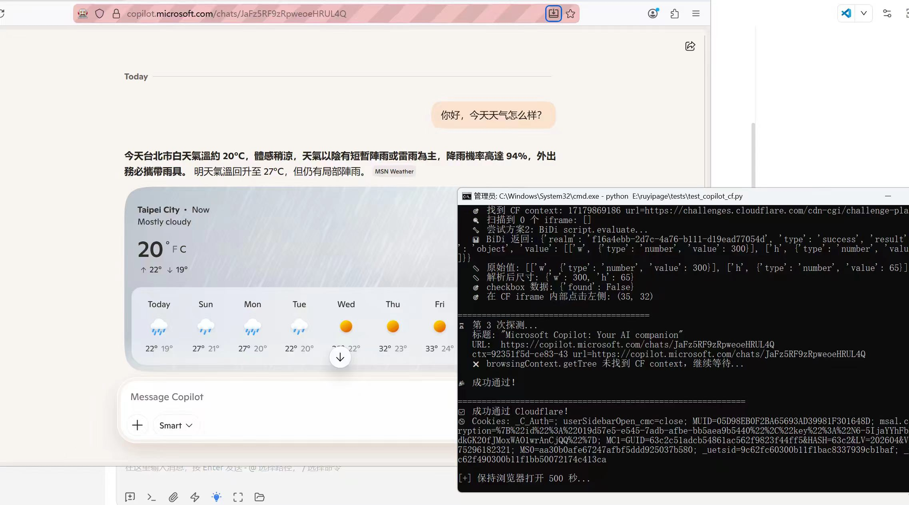
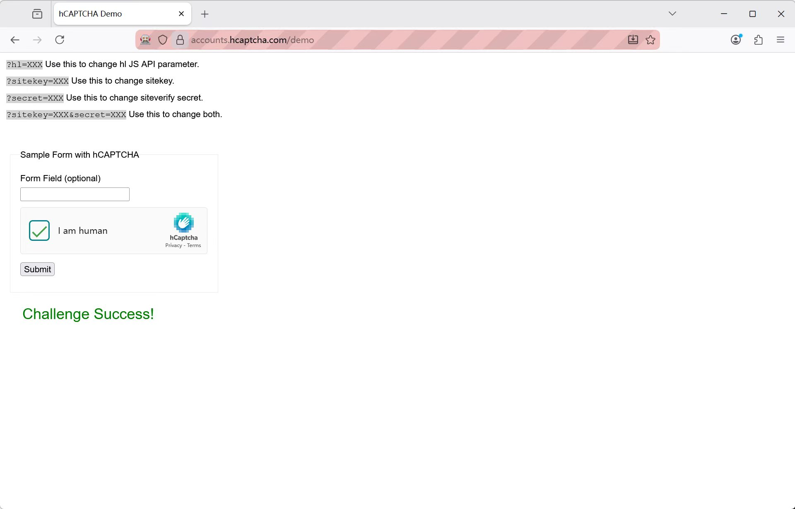
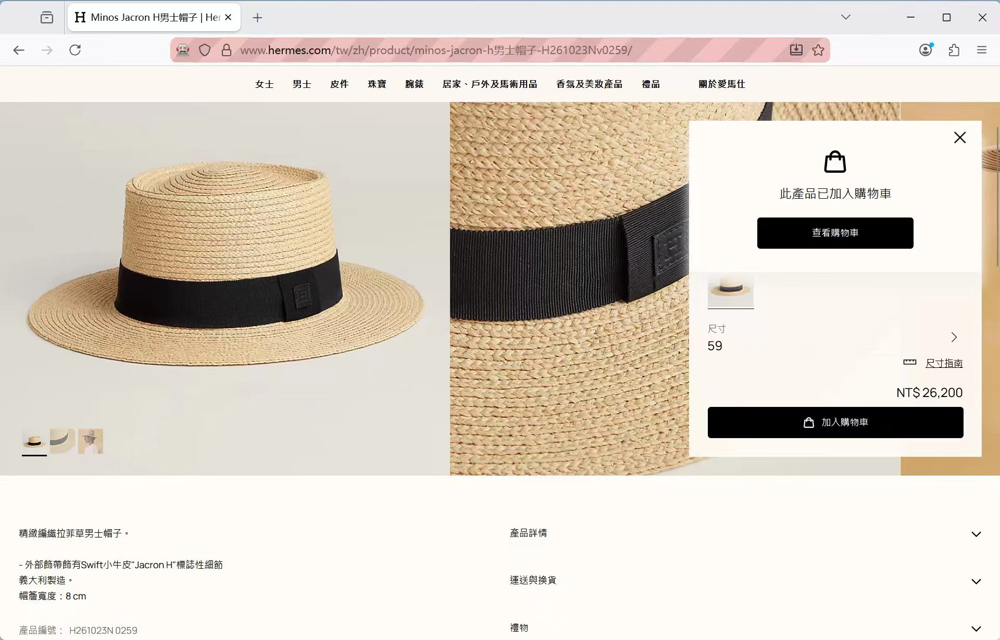
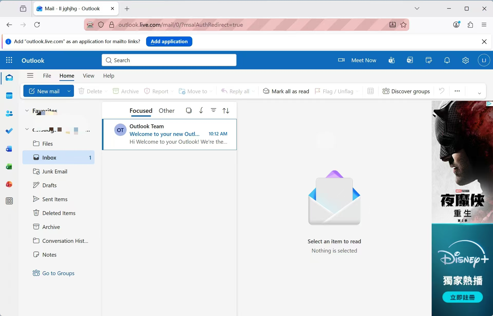
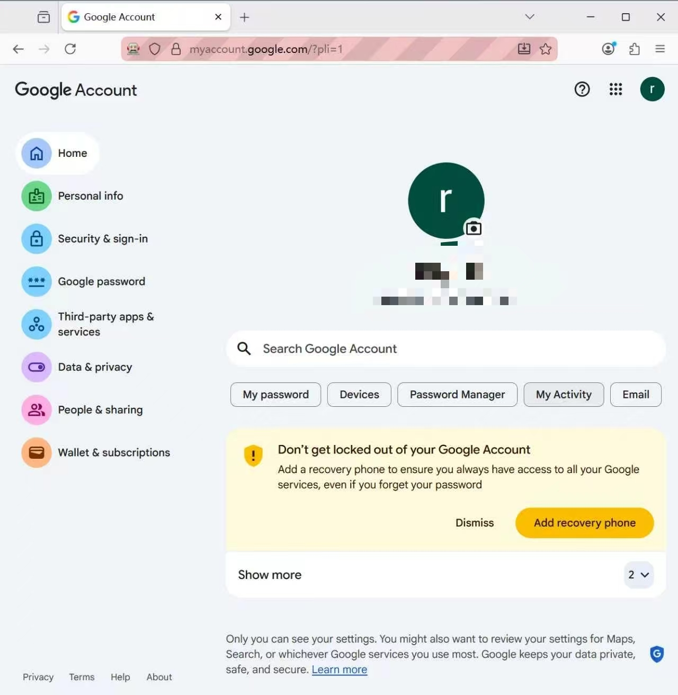

# ruyiPage

<p align="center">
  
</p>

[简体中文](./README.md) | [English](./README_EN.md)

> Built for **AI analysis** and **data capture** workflows, with the ability to intercept arbitrary request and response packets. Ships with a battle-tested anti-detection Firefox fingerprint browser engine for Windows and Linux.
>
> 专用于 **AI 分析** 和 **数据采集** 场景，可拦截任意请求响应包。自带好用的过检测 Win/Linux 火狐指纹浏览器内核。

> **A next-generation automation framework**
>
> - Comes with a **detection-resistant Firefox kernel**
> - A large amount of native **`isTrusted`** actions, with **no automation detection surface**
> - Supports adding **`ruyi: true`** to many JS event constructors so the **`isTrusted`** behavior of `Event`, `InputEvent`, `MouseEvent`, `KeyboardEvent`, and more can stay closer to real interaction
> - Supports **direct automated takeover** of fingerprint browsers such as **ADS**
> - Built-in **HTTP / SOCKS5 password proxy** support, including **one password proxy per tab**
> - Built on **Firefox + WebDriver BiDi**
> - Can directly obtain **closed shadow root** nodes
> - Built-in **JS breakpoint debugging** (`page.debugger`): breakpoints, conditional breakpoints, log points, stepping, call stack, scope, source reading, pause on exception, property watchpoints
> - Better suited for **high-risk scenarios**

[](https://pypi.org/project/ruyiPage/)
[](https://pypi.org/project/ruyiPage/)
[](https://github.com/LoseNine/ruyipage/commits/main)
[](https://github.com/LoseNine/ruyipage/stargazers)
[](https://pepy.tech/project/ruyipage)

## ❤️ Sponsors

> [Want to appear here?](mailto:losenine@163.com)

<table>

<tr>
<td width="180"><a href="http://www.fastaitoken.com/register"></a></td>
<td>🎉 Thanks to FastAIToken for sponsoring this project! <a href="http://www.fastaitoken.com/register">FastAIToken</a> is an AI API aggregation platform built for developers, supporting OpenAI, Claude, Gemini and other mainstream large models. Top-ups are 1:1 — 1 CNY = 1 USD of API credit — so developers can reach the world's leading models at a lower cost and with less friction.<br>

🚀 Multiple routes are available: an ultra-cheap 0.02x OpenAI promotional group (limited time), a 0.25x OpenAI group, 0.7x Claude with 95% fixed caching, and a 1.2x Claude Max route. A public status page shows the availability, latency, and health of every group in real time, and 7×24 human technical support (not a bot) responds quickly to developer requests.<br>

🦊 Covers the full GPT 5.4 / 5.5 series plus the Kiro and Max routes for Claude Opus 4.6 / 4.7 / 4.8. Clean, stable, and durable for everyday use — used by Ruyi itself: <a href="http://www.fastaitoken.com/register">http://www.fastaitoken.com/register</a>
    </td>
  </tr>

</table>

## Real-World Showcase

The images below show real scenarios. To keep the GitHub homepage more compact, they are arranged in a two-column table.

<table>
  <tr>
    <td align="center"><b>Passes Cloudflare 5s challenge</b><br></td>
    <td align="center"><b>Passes hCaptcha</b><br></td>
  </tr>
  <tr>
    <td align="center"><b>Passes DataDome</b><br></td>
    <td align="center"><b>Directly enters Outlook Mail</b><br></td>
  </tr>
  <tr>
    <td align="center"><b>Directly enters Google Mail</b><br></td>
    <td align="center"><b>bet365 real-world demo</b><br></td>
  </tr>
  <tr>
    <td align="center"><b>reCAPTCHA score 0.9 demo</b><br></td>
    <td align="center"><b>Fingerprint browser scan page</b><br></td>
  </tr>
  <tr>
    <td align="center"><b>Firefox-route real-world capability</b><br>Better suited for high-risk pages, login flows, challenges, and realistic interaction scenarios</td>
    <td></td>
  </tr>
</table>

> These images demonstrate real-world capability along the Firefox route.
> If the target site is more heavily protected, it is still recommended to pair it with the Firefox kernel solution recommended by this project or any suitable Firefox fingerprint browser.

---

## Two Kernel-Level Capabilities: Fingerprint and Trace

The bundled kernel adds two things at the Firefox source level. Neither depends on BiDi, and page JavaScript cannot see them.

### Fingerprint (fpfile)

A single `--fpfile=` text file decides the entire fingerprint the browser presents: UA, language, timezone, screen, CPU cores, touch, Canvas / audio perturbation, WebGL GPU parameters, font whitelist, WebRTC, voice list, geolocation, plus HTTP / SOCKS5 proxy credentials. Every value is rewritten inside the native C++ getter with no JS function wrapped, so `toString()` still returns `[native code]` and prototype shapes are unchanged. `navigator.webdriver` is always `false`.

Most callers never write it by hand: `opts.smart_fingerprint()` probes the egress IP, matches language / timezone, and picks one of 22 real-machine hardware profiles automatically. To pin a specific machine or tune individual fields, see [`fingerprint/fpfile-fingerprint.md`](fingerprint/fpfile-fingerprint.md) ([中文](fingerprint/fpfile%E6%8C%87%E7%BA%B9%E8%AF%B4%E6%98%8E.md)) — every key's values, aliases, affected APIs, and how to verify it.

### Trace (`MOZ_DOM_*` environment variables)

Set a few environment variables before launch and the kernel logs what happens at runtime: every JS function call (with arguments, return values, closure variables, and the call tree), DOM property reads and writes, Cookie / Storage operations, exceptions, WASM modules and boundary calls, HTTP packets, WebSocket frames. It can also dump, once, every host interface this build exposes, to compare what the page probed against what does not exist in this environment. A separate `MOZ_DOM_API_*` group directly controls the return values of `Date.now` / `performance.now` / `Math.random` / `crypto.getRandomValues`.

```powershell
$env:MOZ_DOM_TRACE = "1"
$env:MOZ_DOM_TRACE_FILE = "D:\trace\run.jsonl"
$env:MOZ_DOM_JSCALL_TRACE = "1"
& firefox.exe --new-instance -no-remote -profile "D:\profile"
```

This is the primary tool for analysing anti-bot scripts and reconstructing a JS runtime environment. The switch reference is [`trace/trace-cheatsheet.md`](trace/trace-cheatsheet.md) (63 switches with values, defaults, and activation conditions); output formats, causal-chain lookups, and troubleshooting are in [`trace/README.md`](trace/README.md) (Chinese); the decoder for the binary JSCall output is [`trace/tools/jscall_decode.py`](trace/tools/jscall_decode.py).

---

## Installation and Usage

### Installation

```bash
pip install ruyiPage --upgrade
```

If this is your first installation, the command above also works as the default way to install the latest version.

To enable **async (async/await) support**:

```bash
pip install ruyiPage[async] --upgrade
```

This additionally installs `greenlet` and `websockets`. The synchronous API remains completely unaffected.

If you run the project from source, or distribute the source tree to students, install the project dependencies as well:

```bash
pip install -r requirements.txt
```

Verify the installed version after installation:

```bash
python -c "import ruyipage; print(ruyipage.__version__)"
```

### Install the bundled Firefox runtime

`ruyiPage` provides a Playwright-style browser installation flow. After installing the Python package, run:

```bash
python -m ruyipage install
```

This command downloads the recommended Firefox runtime from the `ruyiPage` GitHub release and installs it into the user cache directory. Hash verification is disabled by default so the project can update release assets without requiring an immediate source-code update. After that, `launch()` will prefer this runtime by default. If you pass `browser_path` explicitly, your explicit path still wins.

Common commands:

```bash
python -m ruyipage install --dry-run     # show the download/install plan without downloading
python -m ruyipage install --force       # force a reinstall
python -m ruyipage install --from-file ./firefox.zip
python -m ruyipage path                  # print the installed Firefox executable path
python -m ruyipage doctor                # show current runtime install status
```

If you already have Firefox installed locally, or you use a portable build / fingerprint browser, you can skip this step and keep passing `browser_path` explicitly.

### Simplest launch

```python
from ruyipage import FirefoxPage

page = FirefoxPage()
page.get("https://www.example.com")
print(page.title)
page.quit()
```

### Async (async/await) launch

```python
import asyncio
from ruyipage.aio import launch

async def main():
    page = await launch()
    await page.get("https://www.example.com")
    title = await page.get_title()
    print(title)

    el = await page.ele("#search")
    await el.click_self()
    await el.input("hello async")

    await page.quit()

asyncio.run(main())
```

The async API mirrors the synchronous API exactly -- just add `async/await`.
Properties (e.g. `page.title`) become async methods (e.g. `await page.get_title()`).
Full examples: `quickstart_bing_search_async.py` and `quickstart_cloudflare_async.py` in the project root.

### JS Event `isTrusted` Comparison

`ruyiPage` does not only provide native clicks, typing, hover, and other high-`isTrusted` actions. It also supports adding `ruyi: true` to many JS event constructors so the resulting `isTrusted` behavior stays closer to real user interaction.

For example:

```javascript
new Event('change', { bubbles: true, ruyi: true })
new InputEvent('input', { bubbles: true, data: 'A', inputType: 'insertText', ruyi: true })
new MouseEvent('click', { bubbles: true, clientX: 12, clientY: 24, ruyi: true })
new KeyboardEvent('keydown', { bubbles: true, key: 'Enter', code: 'Enter', ruyi: true })
```

You can run the bundled showcase directly:

```bash
python examples/45_js_setter_untrusted_input.py
```

This example compares normal JS events with `ruyi: true` events and checks `isTrusted` across:

- `Event`
- `InputEvent`
- `KeyboardEvent`
- `MouseEvent`
- `FocusEvent`
- `CustomEvent`
- `PointerEvent`
- `WheelEvent`

### Specify Firefox path and userdir

```python
from ruyipage import FirefoxOptions, FirefoxPage

opts = FirefoxOptions()
opts.set_browser_path(r"D:\Firefox\firefox.exe")
opts.set_user_dir(r"D:\ruyipage_userdir")

page = FirefoxPage(opts)
page.get("https://www.example.com")
print(page.title)
page.quit()
```

Where:

- **`browser_path`**: Path to the Firefox executable. Useful when Firefox is not in the default install directory, you have multiple versions, or you use a portable build.
- **`user_dir`**: Firefox profile / user directory. Useful when you want to reuse login state, keep cookies / local storage, or reuse extensions and preferences. If not set, `ruyiPage` creates a temporary profile automatically, suitable for one-off testing — it is usually cleaned up after closing.

### Beginner-friendly `launch`

```python
from ruyipage import launch

page = launch(
    browser_path=r"D:\Firefox\firefox.exe",
    user_dir=r"D:\ruyipage_userdir",
    headless=False,
    close_on_exit=True,
)

page.get("https://www.example.com")
print(page.title)
page.quit()
```

Where:

- `close_on_exit=True` means the browser started by `ruyiPage` is closed automatically when the Python process exits.
- By default, new launches choose a random available remote-debugging port in `10000-32767` (below the OS dynamic TCP port range, so a port that probed free cannot be grabbed by an outbound connection before Firefox binds it). Use `page.browser.address` if another process needs to attach, or pass `port=12000` / another high fixed port when you explicitly need a stable address.
- If you want to keep the browser window open for manual follow-up after the script exits, set `close_on_exit=False`.
- If you are attaching to an existing browser through `attach()` or `existing_only(True)`, Python exit only disconnects the session even when `close_on_exit=True`; it does not close the external browser process.

### Common `FirefoxOptions` API

If you want more explicit control over browser startup behavior, use `FirefoxOptions` directly.

Start with a complete example that covers the most common options:

```python
from ruyipage import FirefoxOptions, FirefoxPage

opts = FirefoxOptions()
opts.set_browser_path(r"D:\Firefox\firefox.exe")
opts.set_user_dir(r"D:\ruyipage_userdir")
opts.set_proxy("http://127.0.0.1:7890")
opts.set_window_size(1440, 900)
opts.headless(False)
opts.private_mode(False)
opts.close_on_exit(True)

page = FirefoxPage(opts)
page.get("https://www.example.com")
print(page.title)
page.quit()
```

The table below summarizes the `opt` options that users can call directly today.

| Method | What it does | Common use case |
| --- | --- | --- |
| `set_browser_path(path)` | Set the Firefox executable path | Firefox is not in the default location, you use a portable build, or multiple Firefox versions are installed |
| `set_address(address)` | Set the debug address as `host:port` | You already know the exact debug address and want to connect to that instance |
| `set_port(port)` | Set a fixed remote-debugging port and disable random port selection | You need a stable address for attach/debugging, or want to control the exact port |
| `set_random_port(start=10000, end=65535)` | Randomly choose an available remote-debugging port | Default for new launches; useful for avoiding predictable ports such as 9222 |
| `set_auto_port(True)` | Sequentially find an available port | You want deterministic batch startup behavior without manually choosing each port |
| `existing_only(True)` | Attach to an existing browser without launching a new one | Connecting to a manually started Firefox, ADS, or a fingerprint browser |
| `set_retry(times, interval)` | Configure connection retries and retry interval | Slow startup, remote instability, or delayed debug-port readiness |
| `set_profile(path)` | Set the Firefox profile directory | Reusing login state, cookies, extensions, and preferences long-term |
| `set_user_dir(path)` | Beginner-friendly alias for `set_profile()` | When `user_dir` is easier to understand in tutorials and team scripts |
| `close_on_exit(True/False)` | Control whether Python exit closes the browser | Default `True` for script-style cleanup; use `False` to leave the browser open for manual follow-up |
| `private_mode(True/False)` | Enable native Firefox private browsing mode | You want a private session rather than a normal browsing window |
| `headless(True/False)` | Enable or disable headless mode | Servers, background jobs, or flows that do not need a visible UI |
| `set_argument(arg, value=None)` | Add a custom startup argument | Passing through native Firefox startup flags |
| `remove_argument(arg)` | Remove a previously added startup argument | Reusing an options object and undoing a startup flag |
| `allow_system_access(True/False)` | Allow or deny WebDriver access to privileged Firefox contexts | Enable only when automating the parent process, browser UI, extensions, or another privileged context |
| `set_pref(key, value)` | Write Firefox preferences | Adjusting `about:config`, proxy behavior, download behavior, and other browser prefs |
| `set_window_size(width, height)` | Set the startup window size | Controlling initial viewport/layout behavior for target sites |
| `set_proxy(proxy)` | Set an HTTP / HTTPS / SOCKS proxy | Proxy routing, IP switching, geo-specific access |
| `set_download_path(path)` | Set the default download directory | Saving downloaded files into a fixed location |
| `set_load_mode(mode)` | Control page-load waiting strategy | Balancing speed and stability |
| `set_timeouts(base, page_load, script)` | Set element lookup, page load, and script timeouts | Slow pages, slow endpoints, or long-running scripts |
| `set_user_prompt_handler(handler)` | Set default handling for alert / confirm / prompt | Auto-accepting or dismissing dialogs so flows do not block |
| `set_fpfile(path)` | Pass a fingerprint config file through `--fpfile` | Using a Firefox build or fingerprint browser that supports this argument |
| `enable_xpath_picker(True/False)` | Enable the on-page XPath picker panel | Capturing elements, viewing XPath, and generating locator code |
| `enable_action_visual(True/False)` | Enable action visualization for debugging | Inspecting human-like cursor movement, click trails, and key input |
| `quick_start(...)` | Apply a beginner-friendly startup preset in one call | Small scripts, demos, and quick-start usage |

Notes:

- `close_on_exit(True)` is enabled by default, but it only auto-closes browsers started by `ruyiPage` itself.
- If you attach to an external browser through `existing_only(True)` or `attach()`, Python exit only disconnects the session and does not close the external browser process.
- If you do not set `user_dir` / `profile`, `ruyiPage` creates a temporary profile automatically. That is convenient for one-off scripts.
- `set_fpfile()` currently mainly passes the path via `--fpfile=...` and reads proxy-auth fields from that file. If `fpfile` contains SOCKS5 host/port data and `user_dir` is set, ruyipage writes the matching profile proxy prefs. It should not be described as a universal auto-fingerprint configuration entry.
- `quick_start()` is a convenience preset, not a replacement for every `FirefoxOptions` method. When you need precise control, combine the individual `FirefoxOptions` methods directly.
- System access is enabled automatically in elevated Windows sessions to handle Firefox 155 remote-debugging restrictions. It remains disabled by default elsewhere because it broadens remote-debugging privileges; use `allow_system_access(True/False)` to override the automatic choice. It only takes effect at Firefox startup; with `attach()`, the external Firefox process must already have been started with `--remote-allow-system-access`.

If you only want the fastest way to launch, use `launch()`. If you want startup behavior to be more explicit and easier to hand off to end users, prefer `FirefoxOptions`.

### Enable Private Mode

```python
from ruyipage import FirefoxOptions, FirefoxPage, launch

# Option 1: enable Firefox private browsing mode on FirefoxOptions
opts = FirefoxOptions()
opts.private_mode(True)

page = FirefoxPage(opts)
page.get("https://www.example.com")
page.quit()

# Option 2: use launch() directly
page = launch(private=True)

# Quick launch with a proxy
page = launch(proxy="http://127.0.0.1:7890")
page.get("https://www.example.com")
page.quit()
```

Notes:

- `private=True` / `opts.private_mode(True)` adds the `-private` startup argument for Firefox
- This is different from the default temporary `profile`
- If you only want a one-off session without reusing old data, you can also simply omit `user_dir`
- Full example: see the `examples/` directory

### Enable XPath Picker

<p align="center">
  
</p>

```python
from ruyipage import FirefoxOptions, FirefoxPage, launch

# Option 1: enable it on FirefoxOptions
opts = FirefoxOptions()
opts.enable_xpath_picker(True)

page = FirefoxPage(opts)
page.get("https://www.example.com")

# Option 2: use launch() directly
page = launch(xpath_picker=True)
page.get("https://www.example.com")
```

When enabled, a translucent frosted-glass panel appears in the bottom-right corner:

- clicking an element locks the current result
- the panel shows element name, text, absolute XPath, relative XPath, and center `(x, y)`
- a built-in `ruyiPage code generation` tab generates ready-to-use locator code
- iframe, nested iframe, and open / closed shadow root chains are assembled automatically
- `XPath (absolute)`, `XPath (relative)`, and `ruyiPage code generation` all support one-click copy
- while locked, it will not switch to other elements
- click `Continue Picking` to resume picking
- click `Pause Picking` to stop intercepting page clicks temporarily
- click `Collapse` to fold it into a bottom-right capsule and expand it again later

Recommended user-facing example:

```bash
python examples/42_xpath_picker_complex_showcase.py
```

This showcase page covers:

- regular page elements
- same-origin iframes and nested iframes
- open / closed shadow roots
- complex text nodes and SVG nodes

You can also collect every open / closed shadow root from the current page and all child frames in one call:

```python
roots = page.shadow_roots(mode="all")  # all / open / closed
for root in roots:
    item = root.ele("#inside")
```

To scan only the current browsing context without recursing into iframes:

```python
roots = page.shadow_roots(mode="all", include_frames=False)
```

### Mouse Visual Debugging

`ruyiPage` now supports an `action_visual=True` mouse visual debugging mode, which is useful when you need to inspect where the cursor actually moved and what target was really clicked during automation.

When enabled, it shows:

- BiDi mouse movement trails
- Click position highlight / flash feedback
- Current mouse coordinates
- Highlight of the current click target element
- Mouse-side feedback for built-in JS click / JS input paths

This debug mode is intentionally focused on **mouse behavior**, mainly covering:

- `page.actions.move_to()` / `move()` / `human_move()`
- `page.actions.click()` / `double_click()` / `human_click()`
- `page.actions.drag_to()` / `hold()` / `release()`
- `ele.click.left()` / `click_self()` / `double_click()`
- `ele.click.by_js()`
- Mouse positioning feedback for `ele.input(..., by_js=True)`

The simplest way to launch it:

```python
from ruyipage import launch

page = launch(action_visual=True, headless=False)
```

If you prefer enabling it through `options`, you can do it like this:

```python
from ruyipage import FirefoxOptions, FirefoxPage

opts = FirefoxOptions()
opts.enable_action_visual(True)
opts.headless(False)

page = FirefoxPage(opts)
page.get('https://www.example.com')
```

To view the full local demo directly, run:

```bash
python examples/42_2_action_visual_showcase.py
```

If you specifically want to demonstrate `human_move()` / `human_click()` and visually compare
the two human cursor algorithms (`bezier` / `windmouse`), run:

```bash
python examples/46_human_behavior_showcase.py
```

This example will:

- open a dedicated local HTML showcase page
- enable `action_visual=True` so mouse trails are visible on screen
- demonstrate both `bezier` and `windmouse` cursor movement
- also show the effect of `human_type()`

Related API:

```python
opts.set_human_algorithm("windmouse")

page.actions.human_move(ele, algorithm="bezier", style="arc").perform()
page.actions.human_move(ele, algorithm="windmouse").perform()
page.actions.human_click(ele, algorithm="windmouse").perform()
```

Notes:

- `algorithm` can be `"bezier"` or `"windmouse"`
- `style` only applies to `bezier`
- if `algorithm` is omitted, `FirefoxOptions.set_human_algorithm()` provides the default

That example uses a dedicated local mouse-only demo page and showcases:

- BiDi mouse trails
- Click position and target highlighting
- Drag trails
- Visual feedback for JS click

### Multi-Process / Cross-Script Browser Connection

If you already have Firefox running (started by `ruyiPage` or any other
method with the ``--remote-debugging-port`` flag), another Python process
can attach to it via `attach()` — **no new browser will be launched**.

**Usage**:

```python
from ruyipage import attach

# Connect to a Firefox instance started earlier by ruyiPage.
# For default random-port launches, get this value from page.browser.address.
page = attach("127.0.0.1:12000")

print(page.title)
print(page.url)
```

**Typical scenarios**:

- A main process starts Firefox and keeps it alive
- Other processes / scripts connect via `attach()` to reuse the same
  browser instance
- Multiple processes can **attach to the same port concurrently**, each
  with its own independent BiDi session

**Equivalent explicit form (using `FirefoxOptions`)**:

```python
from ruyipage import FirefoxOptions, FirefoxPage

opts = FirefoxOptions().set_address(addr).existing_only(True)
page = FirefoxPage(opts)
```

**Note**:
Passing a raw address string such as `FirefoxPage('127.0.0.1:12000')`
**will attempt to launch a new browser**, not attach to an existing one.
Use `attach()` or explicitly set `existing_only(True)` when you want to
connect to an already-running instance.

---

### Attach to an Already-Open Browser

If Firefox is already open manually, or a fingerprint browser is started first, `ruyiPage` can attach to the existing instance directly.

This flow works for any **Firefox-kernel fingerprint browser**, including products such as ADS / FlowerBrowser.
If the browser lets you set a fixed startup argument, prefer a high port instead of 9222:

```text
--remote-debugging-port=12000
```

If the browser backend rewrites it to a random port, you can still use process-based automatic discovery.

```python
from ruyipage import auto_attach_exist_browser_by_process

page = auto_attach_exist_browser_by_process(
    latest_tab=True,
)

print(page.browser.address)
print(page.title)
print(page.url)
```

Useful when:

- you want to open Firefox manually first and let `ruyiPage` take over afterward
- you want to launch a fingerprint browser first and connect from your business script later
- you are using ADS / FlowerBrowser and the real debugging port changes every run
- you do not want to maintain a port range manually and prefer process-feature-based discovery

---

## Project Positioning and Technical Approach

`ruyiPage` is a Python library focused on **Firefox browser automation**. Its underlying protocol comes from:

- WebDriver BiDi: https://w3c.github.io/webdriver-bidi/

> A high-level automation framework for **Firefox**, with **WebDriver BiDi as the foundation** and beginner-friendly APIs on top.

Unlike many automation libraries that rely heavily on CDP (Chrome DevTools Protocol), `ruyiPage`:

- Uses **Firefox** as the core browser and **WebDriver BiDi** as the core protocol — **no CDP dependency**
- Naturally avoids the CDP exposure surface and aligns with the W3C next-generation browser automation direction
- **Native action chains first**, to keep input, drag, click, and similar behavior closer to real `isTrusted` interaction
- **Built-in human-like interaction support**, better suited to high-risk pages
- **Support for interception, mocking, collectors, and network control**
- **Built-in user context isolation**, suitable for multi-account and multi-session flows in one browser
- **High-level APIs that are easy to get started with**, which also helps teams keep a consistent code style

### BiDi Specification Sync

The repository keeps a reproducible W3C Editor's Draft snapshot and a
source-derived coverage report:

- [Specification snapshot](examples/w3c_bidi/w3c_bidi_apis.json)
- [Coverage report](examples/w3c_bidi/W3C_BIDI_COMPARISON.md)

All 67 commands in the current core snapshot have low-level `_bidi` wrappers,
and all 24 events can be subscribed through the generic `page.events` entry
point. External specifications such as Bluetooth and Permissions are tracked
separately. Whether a new command works at runtime still depends on the Firefox
version.

```bash
python examples/w3c_bidi/extract_w3c_bidi.py --check
python examples/w3c_bidi/generate_comparison.py --check
```

### High-Risk Scenario Recommendation

If your target site is highly sensitive to automation, the Firefox kernel solution provided by this project is the recommended first choice, or use any Firefox fingerprint browser:

- https://github.com/LoseNine/firefox-fingerprintBrowser

Recommended workflow: 1) Use the Firefox kernel solution first → 2) Then use `ruyiPage` for automation control — that combination is generally more stable.

---

## Capability Overview

Before diving into the details, this table gives a quick overview of what `ruyiPage` can already do.

| Category | High-level entry | Typical capabilities |
| --- | --- | --- |
| Page navigation | `page.get()` / `page.back()` / `page.forward()` | Open pages, refresh, navigate backward and forward |
| Element lookup | `page.ele()` / `page.eles()` / `ele.ele()` | CSS/XPath/Text locators, chained lookup inside containers |
| Element interaction | `ele.click_self()` / `ele.input()` / `ele.attr()` / `ele.text` | Click, type, get attributes, read text |
| Action chains | `page.actions` | Keyboard, mouse, drag, wheel, human-like actions |
| Touch input | `page.touch` | Tap, long press, and other touch actions |
| Cookies | `page.get_cookies()` / `page.set_cookies()` / `page.delete_cookies()` | Read, write, and delete cookies |
| Downloads | `page.downloads` | Set download directory, wait for download events, verify saved files |
| PDF / screenshots | `page.save_pdf()` / `page.screenshot()` | Print page to PDF and save screenshots |
| Prompt handling | `page.wait_prompt()` / `page.accept_prompt()` / `page.set_prompt_handler()` | `alert` / `confirm` / `prompt` |
| Navigation events | `page.navigation` | `navigationStarted`, `load`, `historyUpdated`, etc. |
| Generic events | `page.events` | `browsingContext` / `network` / `script` / `input` / `log` events |
| Network control | `page.capture` / `page.network` / `page.intercept` | Passive capture, headers, cache control, interception, mocking, fail, collector |
| Browsing contexts | `page.contexts` | `getTree`, create tab/window, reload, viewport, screencast |
| Browser-level tools | `page.browser_tools` | user contexts, client windows |
| Script capabilities | `page.get_realms()` / `page.eval_handle()` / `page.disown_handles()` | realms, remote handles, preload scripts |
| Emulation | `page.emulation` | UA, viewport, screen, orientation, media features, viewport meta, JS toggle |
| JS debugging | `page.debugger` | Breakpoints, conditional breakpoints, log points, event/XHR breakpoints, property watchpoints, stepping, call stack, scope, source reading, object expansion, Map/Set entries, getter invocation, remote function calls, promise state, pause on exception, blackboxing |
| WebExtension | `page.extensions` | Install unpacked extensions, install xpi, uninstall |
| Local storage | `page.local_storage` / `page.session_storage` | Read and write local/session storage |

---

## How It Compares to Other Frameworks

The table below is not about declaring one framework absolutely better than another. It highlights a few points people usually care about most:

- which browser direction each framework mainly focuses on
- whether it depends on CDP
- how strong the CDP exposure surface is
- how good Firefox / BiDi support is
- how likely it is to be targeted by detection

| Framework | Main browser direction | Underlying protocol | CDP exposure surface | Firefox / BiDi support | Targeted detection |
| --- | --- | --- | --- | --- | --- |
| `ruyiPage` | **Firefox** | **WebDriver BiDi** | **No CDP exposure surface** | **High**, Firefox + BiDi is the main route | **Low**, native BiDi + `isTrusted` behavior + human-like actions fit high-risk scenarios better; even more stable with the Firefox kernel solution recommended by this project or any Firefox fingerprint browser |
| Playwright | Chromium / Firefox / WebKit | Proprietary protocol, many features still lean toward Chromium | Medium to high | Medium, supports Firefox but is not primarily designed around Firefox BiDi | Medium to high, many sites target mainstream automation fingerprints first |
| Selenium | Multiple browsers | WebDriver Classic + partial BiDi | Low to medium | Medium, broad compatibility but weaker high-level BiDi capabilities | Medium, traditional automation traits are widespread |
| Puppeteer | Chromium | CDP | **High** | Low, not really focused on Firefox | **High**, CDP-based exposure is more obvious and more frequently targeted |
| DrissionPage | Chromium | Hybrid driver approach, still mainly Chromium-oriented | Medium to high | Low, Firefox is not the main focus | Medium to high, still easier to fall into mainstream Chromium detection paths |

### One-Line Recommendation

- If you mainly do **Firefox automation**: prefer `ruyiPage`
- If you need **unified multi-browser automation**: prefer Playwright / Selenium
- If you mainly work with **Chromium/CDP**: prefer Puppeteer / Playwright
- If you want **Firefox + no CDP dependency + high-level BiDi APIs**: `ruyiPage` is the more relevant option

---

## Root-Level Quick Start Examples

### 1. Bing Search Example

File: `quickstart_bing_search.py`

It will:

- open Bing
- type a keyword
- press Enter to search
- scrape the first 3 result pages
- print title, URL, and summary

Core pattern:

```python
from ruyipage import FirefoxOptions, FirefoxPage, Keys

opts = FirefoxOptions()
page = FirefoxPage(opts)

page.get("https://cn.bing.com/")
page.ele("#sb_form_q").input("小肩膀教育")
page.actions.press(Keys.ENTER).perform()

for item in page.eles("css:#b_results > li.b_algo"):
    title_ele = item.ele("css:h2 a")
    title = title_ele.text
    url = title_ele.attr("href")
```

### 2. Cloudflare / Copilot Example

File: `quickstart_cloudfare.py`

It will:

- open Copilot
- try to find the input box and send a prompt
- attempt to handle Cloudflare automatically
- print full cookies at the end

This example is especially useful for understanding:

- `page.handle_cloudflare_challenge()`
- `page.get_cookies(all_info=True)`
- how `FirefoxOptions` is written into a beginner-level script

### 3. Fingerprint Browser Example

File: `quickstart_fingerprint_browser.py`

It will:

- launch a Firefox fingerprint browser
- load the fingerprint file through `--fpfile=...`
- open `browserscan` to inspect fingerprint results
- combine geolocation, timezone, locale, request headers, and screen size emulation

Core pattern:

```python
from ruyipage import FirefoxOptions, FirefoxPage

opts = FirefoxOptions()
opts.set_browser_path(r"C:\Program Files\Mozilla Firefox\firefox.exe")
opts.set_fpfile(r"C:\fingerprints\profile1.txt")

page = FirefoxPage(opts)
page.get("https://www.browserscan.net/zh")

page.emulation.set_geolocation(39.9042, 116.4074, accuracy=100)
page.emulation.set_timezone("Asia/Tokyo")
page.emulation.set_locale(["ja-JP", "ja"])
page.network.set_extra_headers({
    "Accept-Language": "ja-JP,ja;q=0.9"
})
page.emulation.set_screen_size(1366, 768, device_pixel_ratio=2.0)
page.refresh()
```

Suitable for:

- combining a Firefox fingerprint browser with `ruyiPage`
- passing fingerprint files, locale, headers, and screen parameters together
- directly validating fingerprint output on sites such as `browserscan`

### 4. HTTP Proxy Auth Example

If you are using this project's own Firefox kernel, the kernel already supports reading HTTP proxy credentials from `fpfile` automatically.

That means the business-layer code only needs:

- `opts.set_proxy("http://host:port")`
- `opts.set_fpfile("...")`

When the `fpfile` contains the following fields, the kernel will handle HTTP proxy authentication internally without any extra auth API call:

```text
httpauth.username:your-proxy-username
httpauth.password:your-proxy-password
```

Full example: `examples/38_proxy_auth_ipinfo.py`

Core pattern:

```python
from ruyipage import FirefoxOptions, FirefoxPage

opts = FirefoxOptions()
opts.set_proxy("http://your-proxy-host:8080")
opts.set_fpfile(r"C:\path\to\your\profile1.txt")

page = FirefoxPage(opts)
page.get("http://ipinfo.io/json")
```

#### SOCKS5 Password Proxy: user_dir + fpfile

If the SOCKS5 proxy address and password are stored in `fpfile`, your code does not need to prepare a Firefox profile ahead of time. Pass `user_dir` and `fpfile`, and ruyipage writes `user.js` in that directory with `network.proxy.socks`, `network.proxy.socks_port`, `network.proxy.socks_version=5`, and `network.proxy.socks_remote_dns=true`. The username and password stay in `fpfile`; they are not written to `user.js`.

For example, an `fpfile` supported by your Firefox kernel can contain:

```text
socksauth.host:proxy.example.com
socksauth.port:1000
socksauth.username:<load from private configuration; do not commit to docs or code>
socksauth.password:<load from private configuration; do not commit to docs or code>
```

```python
from ruyipage import launch

page = launch(
    browser_path=r"C:\firefox\firefox.exe",
    user_dir=r"C:\firefox\socks5-profile",
    fpfile=r"C:\firefox\fp.txt",
    headless=False,
)
page.get("https://ipinfo.io/json")
```

You can still pass `proxy="socks5://host:port"` explicitly. In that case ruyipage uses `proxy` to write the profile prefs, while credentials are still read from `fpfile` by a Firefox kernel that supports `--fpfile`.

Suitable for:

- using your own Firefox kernel with `fpfile`-driven HTTP proxy auth
- keeping business-layer proxy setup minimal
- keeping proxy usernames and passwords inside `fpfile` instead of hardcoding them in scripts

#### Per-tab SOCKS5 proxy pool: `set_per_tab_proxies()` + `new_container_tabs()`

If your Firefox fingerprint kernel already supports `proxy.rotate.*`, ruyipage can now directly:

1. generate a runtime session fpfile;
2. write `proxy.rotate.enabled=true`, `proxy.rotate.exhausted=...`, and multiple `proxy.rotate.proxy=...` lines;
3. create real Firefox container tabs;
4. let each container tab use a different SOCKS5 password proxy.

Minimal usage:

```python
from ruyipage import FirefoxOptions, FirefoxPage

proxies = [
    "proxy.example.com:1000:user1:pass1",
    "proxy.example.com:1000:user2:pass2",
    "proxy.example.com:1000:user3:pass3",
]

opts = FirefoxOptions()
opts.set_browser_path(r"C:\firefox\firefox.exe")
opts.set_per_tab_proxies(proxies, exhausted="wrap")

page = FirefoxPage(opts)
tabs = page.new_container_tabs(count=len(proxies), url="https://browserscan.net/")
```

Accepted proxy formats:

- `host:port:username:password`
- `socks5://host:port:username:password`

Notes:

- `set_per_tab_proxies()` automatically generates a session fpfile inside the profile directory and does not modify your original fpfile directly.
- If you already called `set_fpfile()` first, ruyipage copies the original fpfile content and then appends the `proxy.rotate.*` entries.
- `new_container_tabs()` uses Firefox BiDi `browser.createUserContext` + `browsingContext.create(userContext=...)` to create container tabs; users do not need to install any extra extension themselves.
- This capability depends on your custom Firefox kernel. Official stock Firefox does not guarantee support for `proxy.rotate.*`.

Full example: `examples/52_per_tab_socks5_proxy_browserscan.py`

---

## Most Common API Guide

This is not a raw list of low-level BiDi commands. It focuses on the **high-level APIs most commonly used by beginners**.

Suggested reading order:

1. Start with `FirefoxPage`
   This is the core page object and almost all operations begin there.
2. Then read `ele()` / `eles()`
   Element lookup is one of the most fundamental capabilities.
3. Then read `actions / downloads / network / events`
   These are the most common advanced extensions in automation work.

Documentation style notes:

- this section prioritizes the **most useful and practical** high-level interfaces
- it does not dump raw BiDi commands and ask beginners to assemble parameters themselves
- each capability tries to explain:
  what it does,
  when to use it,
  the most common calling pattern,
  and what you can continue doing with the return value

---

## 1. Page Object: `FirefoxPage`

### Create a page

```python
from ruyipage import FirefoxPage, FirefoxOptions

page = FirefoxPage()

opts = FirefoxOptions()
page = FirefoxPage(opts)
```

### Common properties

| API | Description | Return value |
| --- | --- | --- |
| `page.title` | Current page title | `str` |
| `page.url` | Current page URL | `str` |
| `page.html` | Current page HTML | `str` |
| `page.tab_id` | Current tab browsingContext ID | `str` |
| `page.cookies` | Visible cookies on the current page | `list[CookieInfo]` |

### Common navigation

```python
page.get("https://www.example.com")
page.refresh()
page.back()
page.forward()
page.quit()
```

#### `page.get(url, wait='complete')`

Open a page.

```python
page.get("https://www.example.com")
page.get("https://www.example.com", wait="interactive")
```

Parameter notes:

- `url`
  - the target address to visit
  - common values: `https://...`, `file:///...`, `data:text/html,...`
- `wait`
  - page waiting strategy
  - common values:
    - `complete`: wait until the page fully loads
    - `interactive`: wait until `DOMContentLoaded`
    - `none`: return immediately after navigation is issued

Suitable use cases:

- routine navigation: use the default `complete`
- slow page but you only want the DOM first: use `interactive`
- you will listen for events or wait manually later: use `none`

#### `page.back()` / `page.forward()` / `page.refresh()`

These are used for:

- back
- forward
- refresh

```python
page.back()
page.forward()
page.refresh()
```

If you need to verify navigation events, use them together with `page.navigation`.

---

## 2. Element Lookup: `ele()` / `eles()`

### `page.ele(locator)`

Find a single element.

Most common patterns:

```python
page.ele("#kw")
page.ele("css:.item")
page.ele("css:div.card > a")
page.ele("xpath://button[text()='登录']")
page.ele("tag:input")
page.ele("text:登录")
```

Recommended priority for beginners:

1. `#id`
2. `css:...`
3. `xpath:...`

### `page.eles(locator)`

Find all matching elements.

```python
items = page.eles("css:.card")
rows = page.eles("css:table tbody tr")
links = page.eles("tag:a")
```

### Continue searching inside an element

```python
card = page.ele("css:.card")
title = card.ele("css:h2 a")
desc = card.ele("css:.desc")
```

### Common element APIs

| API | Description | Return value |
| --- | --- | --- |
| `ele.text` | Element text | `str` |
| `ele.html` | Element HTML | `str` |
| `ele.attr(name)` | Read an attribute | `str | None` |
| `ele.click_self()` | Click the element itself | `self` |
| `ele.input(text)` | Type into an input | `self` |
| `ele.clear()` | Clear input content | `self` |

#### `ele.click_self()`

Click the element directly.

```python
page.ele("text:登录").click_self()
```

This is the most recommended click method for beginners.

#### `ele.input(text, clear=True)`

Type content into an input.

```python
page.ele("#kw").input("ruyiPage")
page.ele("#kw").input("ruyiPage", clear=True)
```

Suitable for:

- text input
- search boxes
- file upload inputs

If the element is `<input type="file">`, you can pass a file path directly:

```python
page.ele("#upload").input(r"D:\test.txt")
page.ele("#upload").input([r"D:\1.txt", r"D:\2.txt"])
```

---

## 3. Action Chains: `page.actions`

Used for native BiDi input actions.

```python
page.actions.press(Keys.ENTER).perform()
page.actions.move_to(page.ele("#btn")).click().perform()
page.actions.drag(page.ele("#a"), page.ele("#b")).perform()
page.actions.release()
```

Common uses:

- keyboard input
- mouse clicks
- drag and drop
- wheel scrolling
- human-like movement and clicking

### Common patterns

#### Press Enter

```python
from ruyipage import Keys

page.actions.press(Keys.ENTER).perform()
```

#### Click an element

```python
page.actions.move_to(page.ele("#btn")).click().perform()
```

#### Drag and drop

```python
page.actions.drag(page.ele("#source"), page.ele("#target")).perform()
page.actions.release()
```

### Why `page.actions` is recommended

Because this chain is closer to the native BiDi input model, and many resulting events behave more like real browser input.

---

## 4. Cookies

### Get cookies

```python
cookies = page.get_cookies()
for cookie in cookies:
    print(cookie.name, cookie.value)
```

The returned objects are usually `CookieInfo`. Common fields include:

- `cookie.name`
- `cookie.value`
- `cookie.domain`
- `cookie.path`
- `cookie.http_only`
- `cookie.secure`
- `cookie.same_site`
- `cookie.expiry`

### Filter cookies

```python
cookies = page.get_cookies_filtered(name="session_id", all_info=True)
```

### Set cookies

```python
page.set_cookies({
    "name": "token",
    "value": "abc",
    "domain": "127.0.0.1",
    "path": "/",
})
```

You can also pass multiple cookies at once:

```python
page.set_cookies([
    {"name": "a", "value": "1", "domain": "127.0.0.1", "path": "/"},
    {"name": "b", "value": "2", "domain": "127.0.0.1", "path": "/"},
])
```

### Delete cookies

```python
page.delete_cookies(name="token")
page.delete_cookies()
```

---

## 5. Downloads

High-level entry: `page.downloads`

```python
page.downloads.set_behavior("allow", path=r"D:\downloads")
page.downloads.start()

page.ele("#download").click_self()

event = page.downloads.wait("browsingContext.downloadEnd", timeout=5)
print(event.status)
```

Common methods:

- `set_behavior()`
- `set_path()`
- `start()`
- `stop()`
- `wait()`
- `wait_chain()`
- `wait_file()`

### Typical download flow

```python
page.downloads.set_behavior("allow", path=r"D:\downloads")
page.downloads.start()

page.ele("#download").click_self()

begin = page.downloads.wait("browsingContext.downloadWillBegin", timeout=5)
end = page.downloads.wait("browsingContext.downloadEnd", timeout=5)

print(begin.suggested_filename)
print(end.status)
```

---

## 6. Navigation Events

High-level entry: `page.navigation`

```python
page.navigation.start()
page.get("https://www.example.com")

event = page.navigation.wait("browsingContext.load", timeout=5)
print(event.url)

page.navigation.stop()
```

Suitable for verifying:

- `navigationStarted`
- `domContentLoaded`
- `load`
- `historyUpdated`
- `navigationCommitted`

---

## 7. Generic Event Listening

High-level entry: `page.events`

```python
page.events.start(["network.beforeRequestSent"], contexts=[page.tab_id])
event = page.events.wait("network.beforeRequestSent", timeout=5)
page.events.stop()
```

Suitable for handling:

- `browsingContext.*`
- `network.*`
- `script.*`
- `input.*`
- `log.*`

Return type: `BidiEvent`

Common fields:

- `method`
- `context`
- `url`
- `request`
- `response`
- `error_text`
- `channel`
- `data`
- `multiple`
- `message`

### When to use `page.events`

When you want to listen to protocol-level events directly rather than only caring about the final page state, this is the right tool.

For example:

- listen for `network.beforeRequestSent`
- listen for `browsingContext.contextCreated`
- listen for `script.message`
- listen for `input.fileDialogOpened`

---

## 8. Network Capabilities

High-level entry: `page.intercept` (interception), `page.listen` (monitoring), `page.network` (configuration)

### Request Interception

Intercept the `beforeRequestSent` phase to modify, mock, or block requests:

```python
# Callback mode: intercept and mock a response
def handler(req):
    if '/api/data' in req.url:
        req.mock(
            '{"status":"ok","data":"mocked"}',
            headers={"content-type": "application/json",
                     "access-control-allow-origin": "*"},
        )
    else:
        req.continue_request()

page.intercept.start_requests(handler)
page.get("https://example.com")
page.intercept.stop()
```

```python
# Modify request headers (headers accept a simple dict)
def handler(req):
    req.continue_request(headers={
        "X-Token": "abc123",
        "User-Agent": "RuyiPage/1.0",
    })

page.intercept.start_requests(handler)
```

```python
# Block requests
def handler(req):
    if req.url.endswith(('.png', '.jpg', '.gif')):
        req.fail()
    else:
        req.continue_request()

page.intercept.start_requests(handler)
```

```python
# Queue mode: handle manually
page.intercept.start_requests()
# ... trigger network requests ...
req = page.intercept.wait(timeout=5)
print(req.method, req.url, req.body)
req.continue_request()
page.intercept.stop()
```

### Response Interception

Intercept the `responseStarted` phase to read or modify response info:

```python
# Read the original response status, headers and body
def handler(req):
    print(f"Status: {req.response_status}")
    print(f"Content-Type: {req.response_headers.get('content-type')}")
    req.continue_response()
    # start_responses enables collect_response=True by default,
    # so response_body is available right after continue_response
    print(f"Body: {req.response_body}")

page.intercept.start_responses(handler)
```

```python
# Modify the response status code
def handler(req):
    if '/api' in req.url:
        req.continue_response(status_code=200, reason_phrase="OK")
    else:
        req.continue_response()

page.intercept.start_responses(handler)
```

### Read Response Body in One Step

With `collect_response=True`, use `req.response_body` to read the response body directly — no manual DataCollector needed:

```python
page.intercept.start_requests(collect_response=True)
# ... trigger network requests ...
req = page.intercept.wait(timeout=5)
req.continue_request()
body = req.response_body  # auto-waits for response + decodes
print(body)
page.intercept.stop()     # auto-cleans internal collector
```

### Passive Packet Capture

`page.capture` passively captures full request/response information by URL and method without intercepting or pausing requests. It is suitable for auto-loaded page APIs and supports multiple packets:

```python
page.capture.start("/api/", method="POST")

# Trigger requests normally: open a page, click a button, or run JS
page.get("https://example.com")

# count=1 returns one CapturePacket or None
packet = page.capture.wait(timeout=10)

# count>1 returns a list; on timeout it returns what has been captured
packets = page.capture.wait(timeout=10, count=5)

for p in packets:
    print(p.url, p.method)
    print(p.request_headers)
    print(p.request_body)
    print(p.response_status)
    print(p.response_headers)
    print(p.response_body)

# Captured history for this start() session
all_packets = page.capture.steps

page.capture.stop()
```

For auto-loaded requests, call `page.capture.start()` before opening the page. Already-sent historical requests cannot be captured retroactively.

### Set extra headers

```python
page.network.set_extra_headers({"X-Test": "yes"})
```

This is commonly used to:

- add testing headers to requests
- mark environments
- verify whether headers are actually sent together with interception

### Set cache behavior

```python
page.network.set_cache_behavior("bypass")
```

Where:

- `default`: browser default caching policy; a cache hit may avoid a real request
- `bypass`: try to bypass cache and force a real request

### Data Collector

```python
collector = page.network.add_data_collector(
    data_types=["response"],
)

data = collector.get(request_id, data_type="response")
collector.disown(request_id, data_type="response")
collector.remove()
```

Where:

- `events`
  - `beforeRequestSent`: collect data when the request is sent
  - `responseCompleted`: collect data after the response completes
- `data_types`
  - `request`: collect request bodies
  - `response`: collect response bodies

---

## 9. Browsing Contexts

High-level entry: `page.contexts`

```python
tree = page.contexts.get_tree()
print(len(tree.contexts))

tab_id = page.contexts.create_tab()
page.contexts.close(tab_id)

page.contexts.reload()
page.contexts.set_viewport(800, 600)
```

Common methods:

- `get_tree()`
- `create_tab()`
- `create_window()`
- `close()`
- `reload()`
- `set_viewport()`
- `set_bypass_csp()`

### `tree = page.contexts.get_tree()`

The returned value is not a raw dict but a high-level result object.

```python
tree = page.contexts.get_tree()
print(len(tree.contexts))

first = tree.contexts[0]
print(first.context)
print(first.url)
```

---

## 10. Browser-Level Capabilities

High-level entry: `page.browser_tools`

```python
user_context = page.browser_tools.create_user_context()
contexts = page.browser_tools.get_user_contexts()
page.browser_tools.remove_user_context(user_context)

windows = page.browser_tools.get_client_windows()
page.browser_tools.set_window_state(windows[0]["clientWindow"], state="maximized")
```

Suitable for:

- user context management
- client window management

### Typical usage

```python
ctx = page.browser_tools.create_user_context()
tab_id = page.browser_tools.create_tab(user_context=ctx)
page.contexts.close(tab_id)
page.browser_tools.remove_user_context(ctx)
```

---

## 11. Script Capabilities

### Get realms

```python
realms = page.get_realms()
for realm in realms:
    print(realm.type, realm.context)
```

### Execute script and get a handle

```python
result = page.eval_handle("({a: 1, b: 2})")
print(result.success)
print(result.result.handle)

page.disown_handles([result.result.handle])
```

This flow is suitable when:

- you need a handle to a remote JS object
- you want to release the handle manually after using it

### Preload script

```python
preload = page.add_preload_script("""
() => {
    window.__ready = 'ok';
}
""")

page.get("https://www.example.com")
print(page.run_js("return window.__ready"))

page.remove_preload_script(preload)
```

Suitable for:

- injecting initialization logic before page scripts execute
- attaching hooks, markers, or helper functions before the page starts running

---

## 12. Prompts

High-level entry:

- `page.wait_prompt()`
- `page.accept_prompt()`
- `page.dismiss_prompt()`
- `page.input_prompt(text)`
- `page.set_prompt_handler(...)`
- `page.clear_prompt_handler()`
- `page.prompts.set_auto(accept=True)`

### Typical patterns

#### Wait first, then handle manually

```python
page.run_js("alert('hello')", as_expr=False)
prompt = page.wait_prompt(timeout=3)
page.accept_prompt()
```

#### Handle a prompt automatically

```python
page.set_prompt_handler(prompt="ignore", prompt_text="张三")
page.run_js("prompt('请输入姓名')", as_expr=False)
page.clear_prompt_handler()
```

#### Compatible manager style

```python
page.prompts.set_auto(accept=True)
page.run_js("alert('hello')", as_expr=False)
page.prompts.clear()
```

---

## 13. Emulation

High-level entry: `page.emulation`

```python
page.emulation.set_network_offline(True)
page.emulation.set_javascript_enabled(False)
page.emulation.set_scrollbar_type("overlay")
page.emulation.apply_mobile_preset(
    width=390,
    height=844,
    device_pixel_ratio=3,
    user_agent="...",
)
```

### H5 touch capability

```python
# Override navigator.maxTouchPoints for the current tab at runtime.
result = page.emulation.set_touch_enabled_result(
    True,
    max_touch_points=5,
    scope="context",
    strict=True,
)
print(result.applied, result.source)

# Send trusted pointerType=touch input actions.
page.touch.tap((120, 60)).perform()

# Clear the override for the current tab.
page.emulation.set_touch_enabled(False, scope="context")
```

Older Firefox builds can use an fpfile fallback configured before launch:

```python
options = FirefoxOptions().set_touch_fallback(max_touch_points=5)
page = FirefoxPage(options)
```

`scope` accepts `context`, `user_context`, and `global`. The fallback only takes
effect during browser startup; inspect `TouchOverrideResult` for status and errors.

Notes:

- some emulation commands may not yet be implemented in the current Firefox version
- examples in this project distinguish between “success” and “unsupported”

### Typical usage

```python
page.emulation.apply_mobile_preset(
    width=390,
    height=844,
    device_pixel_ratio=3,
    user_agent="Mozilla/5.0 ...",
)
```

---

## 14. WebExtension

High-level entry: `page.extensions`

```python
ext_id = page.extensions.install_dir(r"D:\my_extension")
page.extensions.uninstall(ext_id)
```

Suitable for:

- verifying whether a content script is active
- testing unpacked extension and xpi installation flows

---

## 15. JS Breakpoint Debugging

High-level entry: `page.debugger`

The WebDriver BiDi specification has **no** debugger module, and Firefox removed CDP entirely in version 141, so breakpoint-level debugging is normally out of reach for a BiDi framework. `ruyiPage` adds a second channel over Firefox's own DevTools remote debugging protocol (RDP), which runs **alongside the BiDi connection without disturbing it**.

### Enabling

The devtools server has to be started with Firefox, so configure it before creating the page:

```python
from ruyipage import FirefoxOptions, FirefoxPage

opts = FirefoxOptions()
opts.enable_debugger()          # writes the required prefs and adds --start-debugger-server
page = FirefoxPage(opts)

page.debugger.start()           # connect and attach to the current tab
```

`enable_debugger(port=6000)` selects the port. `start(auto_resume_after=30)` enables the pause watchdog (see the caveats below).

### Reading source

```python
for s in page.debugger.sources():
    print(s.url)

code = page.debugger.source_text('app.js')          # also accepts a Source object
lines = page.debugger.breakable_lines('app.js')     # which lines accept a breakpoint
```

`source_text()` returns **the exact text the JS engine is executing**, so its line numbers line up with breakpoint locations and the `line` reported in the call stack. Downloading the URL yourself cannot match that:

- `eval` / `new Function` / blob scripts have no downloadable address at all
- inline `<script>` line numbers are relative to the whole HTML document

### Setting breakpoints

```python
bp = page.debugger.set_breakpoint('app.js', 42)
bp = page.debugger.set_breakpoint('app.js', 42, condition='quantity > 3')

page.debugger.remove_breakpoint(bp)
page.debugger.clear_breakpoints()
```

When `column` is omitted it is resolved from the source's real breakpoint positions. Firefox **silently ignores** breakpoints that do not land on a valid position (no error, never fires), so never guess the column.

Breakpoints are keyed by URL, and the server re-applies them after navigation, so there is no need to set them again.

### Log points

Passing `log_value` turns a breakpoint into a log point: it **does not pause**, it just records the value of the expression. Since arbitrary expressions cannot be evaluated while paused (see "Current limitations"), this is the easiest way to watch a running variable — especially one that changes on every loop iteration.

```python
page.debugger.set_breakpoint('app.js', 42, log_value='quantity, subtotal')

page.run_js('return window.buildCart();')     # does not block, no background thread needed

for entry in page.debugger.wait_logs(count=3):
    print(entry['values'], entry['line'])     # [1, 12.5] 42
```

Conditions and log values combine, so you can record only the iterations you care about. Pass `log_stacktrace=True` to attach the call stack.

> These messages are injected straight into the DevTools console pipeline by the debugger and **never go through the real console API**, so `page.console` cannot see them — read them from `debugger.logs()` / `wait_logs()`. Conversely, the page's own `console.log` calls never leak into them.

### Pausing and stepping

```python
state = page.debugger.wait_paused(timeout=30)   # -> PausedState
print(state.why, state.url, state.line)

page.debugger.step_over()
page.debugger.step_into()
page.debugger.step_out()
page.debugger.resume()

page.debugger.pause()                            # pause immediately
page.debugger.on_paused(lambda s: print(s))      # callback style
```

### Call stack and scope

```python
for f in page.debugger.frames():
    print(f.display_name, f.url, f.line, f.arguments, f.this_object)

scope = page.debugger.scope()                      # locals + arguments + this
scope = page.debugger.scope(include_parents=True)  # also closures and globals
```

`scope()` walks out to the **function boundary** by default (the current block plus its enclosing function), stopping before the global scope. Reading only the innermost block would show a single uninitialised variable when paused on `const x = ...`, with every function argument missing.

`this` is not an environment binding — it lives on the frame — and `scope()` returns it under the `'this'` key (`this` is a reserved word, so it can never collide with a local).

The global object is likewise absent from the environment chain, so reach `window` like this:

```python
window = page.debugger.global_object()
page.debugger.get_property(window, 'appConfig')
```

### Expanding objects

Objects in scope come back as `RemoteObject`, with the protocol's embedded preview already decoded into readable values (arrays become `list`, plain objects become `dict`). That layer costs **no extra request**:

```python
items = scope['items']
print(items.class_name, items.value, items.truncated)
```

A preview carries at most ten entries; `truncated` is `True` when it does not fit. For the full contents:

```python
page.debugger.expand(obj, depth=3)          # recursive expansion
page.debugger.get_property(obj, 'probe')    # targeted lookup (use this for large objects)
page.debugger.constructor_name(obj)         # real class name, e.g. 'Cart'
```

> `class_name` reflects the JS `[[Class]]`, which is `'Object'` for ordinary class instances; the real class name is derived from the prototype chain by `constructor_name()`.
>
> `window` has over a thousand properties, so a full `expand()` gets cut off at `max_items` (a warning is logged) — use `get_property()` in that case.

`get_property()` resolves the way normal JS property access does: if there is no own property it keeps looking up the prototype chain, so class methods (which live on the prototype) are reachable too. Pass `own_only=True` to restrict it to own properties.

`RemoteObject` equality compares the class name and contents only, **not the actor id**. Object actors are recreated on every resume, so comparing by actor would report every object as changed when diffing scope snapshots across a step.

### Reading things that are not plain properties

`expand()` only sees plain properties. These each need their own call:

```python
# Map / Set entries are not properties, and the preview carries at most ten
page.debugger.entries(obj)          # Map -> {key: value}; Set -> [value, ...]

# Accessors show up as '<accessor>' by default; reading one runs page code
page.debugger.invoke_getter(obj, 'total')

# Very long strings arrive truncated; used as a plain str you get the short form
page.debugger.read_string(scope['html'])

# Promise state and result
page.debugger.promise_state(obj)    # {'state': 'fulfilled', 'value': 99, ...}
```

### Calling functions remotely

Arbitrary expressions cannot be evaluated while paused, but **functions that already exist on the page** can be called — including the business code itself:

```python
fn = page.debugger.get_property(scope['app'], 'formatPrice')
print(page.debugger.call(fn, args=[12.5]))            # '$12.50'

# Both arguments and `this` accept remote objects
page.debugger.call(fn, args=[scope['item']], this=scope['app'])
```

An exception thrown inside the function is surfaced as a `DebuggerError` carrying the thrown value.

### Property watchpoints

For tracking down "what actually wrote this value" — CDP has no equivalent:

```python
page.debugger.watch_property(obj, 'token', on='set')   # or 'get' / 'getorset'

state = page.debugger.wait_paused(timeout=30)
print(page.debugger.frames())        # exactly who wrote it

page.debugger.unwatch_property(obj)  # omit the name to clear all watchpoints on the object
```

> The target property must **already exist**, be configurable, and be a data property (not a getter/setter). Otherwise the server silently ignores the request — it sends no reply, so this cannot be detected client-side.

### Pause on exception

Instead of guessing where the failure is and setting a breakpoint there, let the page run and stop at the throw site:

```python
page.debugger.pause_on_exceptions(True, ignore_caught=True)

state = page.debugger.wait_paused(timeout=30)
if state.is_exception:
    print(state.exception)      # decoded TypeError etc., with message and stack
```

`ignore_caught=True` (the default) skips exceptions that a `catch` will handle; otherwise the page's normal try/catch flow keeps triggering pauses.

`pause_on_debugger_statement()` controls whether JS `debugger` statements pause.

### Event and XHR breakpoints

Break on behaviour instead of having to know which file and line a handler lives in:

```python
# which events does the kernel support (group name -> event ids)
print(page.debugger.available_event_breakpoints())

# pause whenever any click handler runs
page.debugger.set_event_breakpoints(['event.mouse.click'])

state = page.debugger.wait_paused(timeout=30)
if state.is_event_breakpoint:
    print(state.event_breakpoint)      # 'event.mouse.click'
    print(page.debugger.frames())      # shows exactly where the handler is

page.debugger.set_event_breakpoints([])   # an empty list clears them
```

```python
# pause when a request URL contains /api/
page.debugger.set_xhr_breakpoint('/api/', method='GET')

state = page.debugger.wait_paused(timeout=30)
if state.is_xhr:
    print(page.debugger.frames())      # who issued this request

page.debugger.remove_xhr_breakpoint('/api/', method='GET')
```

An empty `path` with `method='ANY'` matches every request. Both kinds are effective for "the click does nothing" and "where does this request come from" investigations.

### Blackboxing framework code

Without blackboxing on a real page, `step_into` dives straight into React or jQuery internals and it is hard to get back to your own code:

```python
page.debugger.blackbox('https://cdn.example.com/react.min.js')
page.debugger.blackbox('vendor.js', start_line=1, end_line=5000)   # or just a line range

print(page.debugger.blackboxed())      # currently flagged sources
page.debugger.unblackbox('vendor.js')
```

Several inline scripts in one HTML document share a URL and are all flagged together.

### Other execution controls

```python
page.debugger.skip_breakpoints(True)    # ignore every breakpoint without deleting them
page.debugger.restart_frame()           # re-run the current frame from its entry (side effects are not undone)
page.debugger.include_async_frames()    # include async parent frames in the call stack
```

`include_async_frames()` matters on modern pages: with heavy async/await the synchronous stack is often a single frame and reveals nothing about the caller. Once enabled, each frame's `asyncCause` explains how it was chained.

### ⚠️ Required reading

**While JS is paused, every BiDi call that needs the JS thread blocks until timeout** (`run_js`, clicking, reading element text). The call that triggers a breakpoint must therefore run on a background thread:

```python
import threading

page.debugger.set_breakpoint('app.js', 42)

threading.Thread(
    target=lambda: page.run_js('return window.doWork();', timeout=60),
    daemon=True,
).start()

state = page.debugger.wait_paused(timeout=30)
# ... inspect using page.debugger APIs only ...
page.debugger.resume()
```

For unattended scripts, enable the watchdog so a missed `resume()` cannot wedge the page permanently:

```python
page.debugger.start(auto_resume_after=30)
```

`stop()` resumes a paused page before disconnecting, so it never leaves the page suspended.

### Current limitations

- **Arbitrary expressions cannot be evaluated while paused.** This is a protocol limitation rather than a gap: Firefox's `evaluateJSAsync` never delivers its result during a pause, and the `frame` actor has no eval method. There are three ways around it: read state with `scope()` + `expand()` + `get_property()`, call existing page functions with `call()`, or record any expression without pausing at all using a **log point**.
- **Variable values cannot be modified.** The `environment` actor spec declares an empty `methods` map, so it is read-only.
- **Script source cannot be hot-patched.** Firefox never implemented anything like CDP's `setScriptSource` live edit.
- **Only the top-level tab is covered**; JS inside iframes and Workers is out of reach.
- **No source map resolution** — the server only exposes `sourceMapURL` metadata, so minified line numbers must be mapped client-side.
- RDP is a Firefox-private protocol with no cross-version compatibility guarantee.

See `examples/55_js_debugger.py` and `examples/56_ai_autonomous_debug.py` (the latter shows the full loop where only the page URL is given and the program discovers the code and breakpoint location by itself).

---

## 16. Representative Examples

The repository already includes many examples. It is recommended to learn them by number.

Suggested order:

### Beginner

- `01_basic_navigation.py`
- `02_element_finding.py`
- `03_element_interaction.py`
- `05_actions_chain.py`
- `06_screenshot.py`

### Page and script

- `07_javascript.py`
- `08_cookies.py`
- `09_tabs.py`
- `13_iframe.py`
- `14_shadow_dom.py`

### Advanced capabilities

- `17_user_prompts.py`
- `18_advanced_network.py`
- `19_pdf_printing.py`
- `20_advanced_input.py`
- `21_emulation.py`

### Strict-result examples

- `23_download.py`
- `24_navigation_events.py`
- `25_browser_user_context.py`
- `37_three_isolated_user_context_tabs.py` single browser, multiple tabs, different user contexts, isolated cookies
- `26_browsing_context_advanced.py`
- `27_emulation_advanced.py`
- `28_network_data_collector.py`
- `29_script_input_advanced.py`
- `30_browsing_context_events.py`
- `31_network_events.py`
- `32_script_events.py`
- `33_log_input_events.py`
- `34_remaining_commands.py`
- `35_native_bidi_drag.py`
- `36_native_bidi_select.py`
- `39_attach_exist_browser.py` auto-detect an attachable instance, then take over the already-open Firefox / fingerprint browser
- `42_xpath_picker_complex_showcase.py` starts XPath picker and opens a showcase page with complex nodes, shadow roots, and nested iframes
- `46_human_behavior_showcase.py` demonstrates both bezier and windmouse human cursor algorithms with action visualization enabled
- `52_per_tab_socks5_proxy_browserscan.py` single browser, multiple container tabs, each tab using a different SOCKS5 password proxy
- `53_duckai_eventstream_capture.py` opens Duck.ai with Firefox, submits a chat prompt, and captures the `POST /duckchat/v1/chat` EventStream response body
- `54_bing_passive_capture.py` uses `page.capture` to start passive capture before opening Bing search, then prints auto-loaded request/response headers and bodies
- `55_js_debugger.py` `page.debugger` API tour: source, breakpoints, conditional/log points, stepping, stack and scope, object inspection, exception/event/XHR breakpoints, watchpoints, blackboxing
- `56_ai_autonomous_debug.py` autonomous debugging loop: given only the page URL, discover sources, pick a breakpoint, inspect the throw site, and find a click handler

---

## Smart Fingerprint API

`ruyiPage` provides an out-of-box smart fingerprint flow on top of `firefox-fingerprintBrowser`: probe egress IP → match locale/timezone/voices → pick one of 22 hardware profiles → write `fpfile.txt`. By default it does not set an external window; call `ctx.apply_emulation(page)` only after `page = FirefoxPage(opts)`.

### Recommended order

```python
from ruyipage import FirefoxOptions, FirefoxPage, CountryMismatchError

opts = FirefoxOptions()
opts.set_browser_path(r"C:/Program Files/Mozilla Firefox/firefox.exe")

ctx = opts.smart_fingerprint(...)

page = FirefoxPage(opts)
ctx.apply_emulation(page)  # ctx -> page -> ctx.apply_emulation(page)
```

`set_window_size_on_opts` is retained as a deprecated no-op. Smart fingerprinting never maps `screen.width` / `screen.height` to the Firefox outer window. If an explicit outer window is required, call `opts.set_window_size(width, height)` yourself before creating `FirefoxPage`. `fpfile.txt` no longer stores `width` / `height`.

By default, smart fingerprinting adds an `about:blank` startup page so the BiDi overlays can run immediately without `remote-allow-system-access`. Pass `set_startup_page_on_opts=False` when you already provide a script-accessible custom startup URL.

### Pipeline notes

- Geo lookup uses ten fallback sources. Optional IPv6 lookup enriches diagnostics only; it is never copied into WebRTC policy fields automatically.
- Kernel keys this pipeline does not populate itself (`touch.maxTouchPoints`, `fonts.whitelist`, `width`/`height`, `screen.devicePixelRatio`, `media.devices`, the remaining `webgl.*` / `webgl2.*`, `webgpu.*`) can be appended through `extra={...}`.
- All 53 WebGL fields are written at once, leaving no key to fall back to the real adapter. The values come from a real ANGLE/D3D11 dump: `webgl.vendor` is `Mozilla`, while `webgl.renderer` and `webgl.unmasked_renderer` are both `ANGLE (...), or similar` - that suffix is upstream Firefox's real shape, not a placeholder. Limits, extension list and shader precision are ANGLE/D3D11 constants; only `webgl.unmasked_*` varies per model.
- Pass `profile_id="win-rtx3060"` to pin one of the bundled profiles instead of sampling at random; `list_hardware_profiles()` enumerates the ids. Pinning is what lets you build matching `extra` entries such as `width` / `height`.
- `require_country` is not decided by a single source: geo databases disagree about the same address, and some can only report where the ASN is registered, so `CountryMismatchError` needs two sources reporting the same wrong country.
- The generated UA uses the major version reported by `opts.browser_path`; it falls back to the bundled baseline only when the executable cannot be queried, without version jitter.
- After Firefox starts, `ctx.apply_emulation(page)` sets `screen.width` / `screen.height` / `screen.avail*` through `page.emulation.set_screen_size(hw.width, hw.height)`.
- For an async page, use `await ctx.apply_emulation_async(async_page)`. This entry point is always awaitable, including when every overlay is disabled.
- Firefox keeps `outerWidth` / `innerWidth` / viewport geometry natively, and they change with the real window.
- We do not add production coordinate compensation such as 15/92 or 16/93; 16/93 is only for real-machine verification of the target fingerprint browser.
- The `apply_emulation()` result includes `screen`, `geolocation`, `locale`, `timezone`, and `headers`.
- WebRTC: when a proxy is configured the fpfile carries `webrtc.ice_proxy_only:true`, which removes the srflx candidate. Pass `webrtc_ice_proxy_only=False` to fall back to native ICE, where a direct srflx address may differ from the HTTP proxy egress. `local/public_webrtc_*` are still written only when the caller supplies real addresses, and they do not filter every host candidate.
- Geolocation latitude, longitude, accuracy, altitude, altitude accuracy, heading, and speed are shared across fpfile and BiDi. A numeric `geolocation_timestamp` is Unix epoch milliseconds; timestamps and `prompt`/`denied` permission states stay kernel-managed because BiDi does not represent them.

### Full fpfile field reference

The smart fingerprint API writes the `fpfile` for you, so most callers never touch it by hand. When you need to **pin a specific real-machine profile**, **tune fields the smart flow does not cover** (WebGPU, voice lists, geolocation details, and so on), or **use the kernel without ruyiPage**, every `fpfile` field — value ranges, aliases, defaults, the JS/HTTP APIs it affects, and how to verify each detection point — is documented in:

**[`fingerprint/fpfile-fingerprint.md`](fingerprint/fpfile-fingerprint.md)** (Chinese version: [`fpfile指纹说明.md`](fingerprint/fpfile%E6%8C%87%E7%BA%B9%E8%AF%B4%E6%98%8E.md))

It covers all ten detection categories (automation detection, hardware/device, Canvas, WebGL, audio, fonts, Navigator consistency, WebRTC/media, timezone/language, anti-hook), plus network proxy and auth, WebGPU, a required-keys checklist, and a one-shot self-check script.

---

## Protocol Source

The core capabilities of `ruyiPage` are aligned with and based on:

- WebDriver BiDi: https://w3c.github.io/webdriver-bidi/

This is also the design source for many high-level APIs in this project, such as:

- `browsingContext.*`
- `network.*`
- `script.*`
- `input.*`
- `browser.*`
- `emulation.*`

---

## Star History

<a href="https://www.star-history.com/?repos=LoseNine%2Fruyipage&type=timeline&legend=top-left">
 <picture>
   <source media="(prefers-color-scheme: dark)" srcset="https://api.star-history.com/chart?repos=LoseNine/ruyipage&type=timeline&theme=dark&legend=top-left" />
   <source media="(prefers-color-scheme: light)" srcset="https://api.star-history.com/chart?repos=LoseNine/ruyipage&type=timeline&legend=top-left" />
   
 </picture>
</a>

---

## Usage Statement and Disclaimer

This project is intended only for:

- exploring next-generation automation frameworks
- learning Firefox automation capabilities
- learning the WebDriver BiDi protocol
- learning high-level browser automation API design
- lawful, compliant, non-commercial personal research and technical exchange

### Scope of Authorization

Anyone may use or distribute the source code of this project in a personal capacity, but only for:

- learning purposes
- technical research purposes
- lawful, compliant, non-commercial purposes

Without authorization from the copyright holder, individuals or organizations may not use this project, in source or binary form, for commercial activities.

### Terms of Use

Use of this project must comply with the following terms. If any term is violated during use, the authorization automatically becomes invalid.

- Do not apply `ruyiPage` to any project that may violate local laws or ethical constraints
- Do not use `ruyiPage` in any project that may harm the interests of others
- Do not use `ruyiPage` for attacks, harassment, bulk abuse, malicious registration, credential stuffing, traffic fraud, or similar behavior
- Do not use `ruyiPage` to bypass platform security mechanisms and then carry out illegal actions
- Users must comply with the target website or system's robots rules, terms of service, and local laws and regulations
- Do not use `ruyiPage` to collect data that is explicitly disallowed by law, terms, or robots policies

### Risk and Responsibility

All actions taken with `ruyiPage` are the sole responsibility of the user.

Any disputes or consequences arising from the use of `ruyiPage` are unrelated to the copyright holder.

The copyright holder is not responsible for any risks, losses, bans, restrictions, data issues, legal consequences, or indirect damages resulting from the use of `ruyiPage`.

The copyright holder is also not responsible for any losses caused by possible defects in `ruyiPage`, compatibility issues, misuse risks, or strategy changes on target websites.

### Special Note

This project emphasizes:

- Firefox automation
- BiDi protocol capability
- `isTrusted` behavior
- human-like interaction capability
- adaptation to high-risk scenarios

But these capabilities are limited to **lawful, compliant, and legitimate** technical research and automation scenarios.

---

## Companion Projects

If you plan to use `ruyiPage` for AI-driven automation analysis, advanced web data capture, or high-risk browser workflows, start with these companion resources:

- 📘 **Documentation / Automation Docs**
  A central place for `ruyiPage` automation guidance, integration notes, and supporting project documentation: <https://0xshoulderlab.site/automation>
- 🦊 **Firefox fingerprint browser project**
  Intended for cases where you need a Firefox fingerprint environment, browser takeover, or more realistic automation behavior alongside `ruyiPage`: <https://github.com/LoseNine/firefox-fingerprintBrowser>
- 🔌 **MCP Server: ruyi-mcp**
  A community-maintained integration built with the TypeScript MCP SDK and a persistent Python bridge, exposing `ruyiPage` browser automation, network capture, fingerprint analysis, human-like interaction, and WebDriver BiDi JSON Trace workflows to Claude Code, Codex, Cursor, and other MCP clients. Thanks to @Facetomyself for the implementation and maintenance: <https://github.com/Facetomyself/ruyi-mcp>
- 🟨 **JavaScript implementation: ruyipage-js**
  A companion implementation for the JavaScript / Node.js ecosystem, useful when you want to bring the `ruyiPage` approach and capabilities into JS-based projects: <https://github.com/GanFish404/ruyipage-js>
- 🐹 **Go implementation: ruyipage-go**
  A community-maintained Go implementation for teams that want to integrate Firefox automation capabilities into Go projects. Thanks to @pll177 for the implementation and maintenance: <https://github.com/pll177/ruyipage-go>
- 🖥️ **Desktop GUI manager: ruyiBrowser-GUI**
  A graphical Firefox fingerprint browser management tool built with Electron + Vue3. Create, manage, and launch multiple isolated fingerprint environments without the command line. Thanks to @jacklaigougou for the implementation and maintenance: <https://github.com/jacklaigougou/ruyiBrowser-GUI>

---

## Buy Me a Coffee

If this project helps you, you are welcome to buy me a coffee and support continued work on `ruyiPage`.

<table>
  <tr>
    <td align="center">
      <b>Official Account</b><br>
      
    </td>
    <td align="center">
      <b>QQ Group</b><br>
      
    </td>
    <td align="center">
      <b>Contact Me / WeChat</b><br>
      
    </td>
    <td align="center">
      <b>Buy Me a Coffee</b><br>
      
    </td>
  </tr>
</table>
